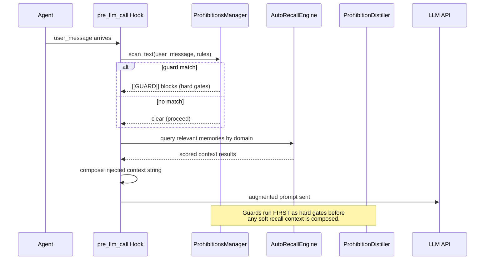

# MemChorus

**Current version:** 2.0.01

Memory orchestration layer for AI agents that need persistent, intelligent context across sessions and tools.

MemChorus treats memory not as a single store but as a **chorus of distinct sources** — each with different strengths, costs, and semantics. An orchestrator sits in front, deciding where to write and which sources to consult on reads so the agent gets the right context without wasting compute or tokens.

The primary enhancement backend is [MemPalace](https://github.com/MemPalace/mempalace) — a knowledge graph with semantic search connected via MCP protocol — but the system degrades gracefully if MemPalace is unavailable, falling back to local Hermes default files that always work. Other sources (remote APIs, vector stores, note databases) plug in through the `MemorySource` abstract class without requiring changes to the core orchestrator.

### About MemPalace

MemChorus uses [**MemPalace**](https://github.com/MemPalace/mempalace)
([project website](https://mempalace.github.io), licensed under MIT) as its
primary enhancement memory backend.  MemPalace provides a structured knowledge
graph with semantic search, diary journals, and an extensible "wing" model for
organising memories by domain.  It is reached through the MCP (Model Context
Protocol) stdio transport so that MemChorus can treat it as just another
`MemorySource` — pluggable at runtime without compile-time bindings.

MemPalace is **not required** for MemChorus to function.  If the MCP server is
unreachable or the `[mcp]` extra is not installed, MemChorus falls back to
local Hermes default files transparently.  Full attribution and copyright for
the MemPalace project belongs to its authors; MemChorus simply provides the
orchestration layer that routes reads/writes across it alongside any other
registered source.

**Multi-profile isolation:** If you run multiple Hermes profiles, configure a
separate MemPalace database per profile to prevent memory cross-contamination.
Add a profile-specific `mempalace` MCP server entry in each profile's
`config.yaml` pointing to independent paths, for example:
`~/.hermes/profiles/<name>/workspace/mempalace/palace/data.db`. Profiles should
communicate via Kanban tasks rather than sharing memory graphs directly.

## Philosophy

The design is driven by two questions:

1. **On recall: What is the cheapest way to get the context needed for this decision right now?**
   Not every memory source deserves an equal share of attention. MemChorus ranks results across all available backends, applies relevance scoring tuned to the current query domain, and serves only what matters.

2. **On write: Where should this memory live for future value?**
   A passing thought is different from a permanent preference. Memory characteristics (size, content type, intended longevity) guide placement so nothing sits in the wrong tier for too long.

The system must stay functional even if every enhancement source disappears. The Hermes default memory files (`MEMORY.md`, `USER.md`) form the resilient foundation that keeps an agent alive with core context regardless of what else breaks.

## High-Level Architecture


*Diagram source: [`diagrams/architecture.d2`](diagrams/architecture.d2) — edit with D2 to regenerate.*
### Component Summary

| Component | Role |
|---|---|
| `MemorySource` (ABC) | Pluggable backend interface — 8 user-facing methods (`save`, `retrieve`, `search`, `proactive_check`, `proactive_save`, `get_source_info`, `is_available`, `delete`) plus `__init__` |
| `HermesDefaultMemorySource` | Local curated files on disk. Always-available fallback. |
| `MemPalaceMemorySource` | [MemPalace](https://github.com/MemPalace/mempalace) backend via MCP protocol. Knowledge graph, semantic search, diary journals. |
| `MemoryOrchestrator` | Unified facade — registers sources, routes reads/writes, applies scoring, enforces deduplication |
| `RelevanceScorer` | Domain-aware ranking engine with keyword extraction, recency decay (default half-life = 30 days), and cached results |
| `BehavioralTrigger` | Detects decision points in agent interaction streams for proactive memory surfacing |
| `AutoRecallEngine` | Automatically queries relevant memories at detected decision points before the agent acts |
| `AutoStorageEngine` | Captures significant outcomes after actions complete with deduplication guards |
| `BehavioralEnforcementManager` | Wires Trigger → Recall → Storage into a unified pipeline; returns structured results per call |
| `MemoryProfile` | Classification enum guiding smart placement decisions at write time |
| `SessionSearchMemorySource` | Fallback recall via FTS5 full-text search over Hermes session history, surfacing past mistakes/decisions from conversation transcripts |
| `StorageResilience` | Retry-with-backoff and per-drawer isolation layer for ChromaDB/MemPalace saves; prevents transient failures from aborting entire batches |
| `MemPalacePersistentSession` | Long-lived MCP session keeping the server alive across calls to prevent ChromaDB compactor crashes from repeated spawn-and-kill cycles |
| `Orientation` | Session-start recall that injects project context (KG triples + semantic search, limited to 5 items) with 15s cache TTL |
| `WorkflowCompliance` | Automated verification that development lifecycle (branch -> implement -> test -> review -> merge -> push -> install-from-SHA) completed; surfaces compliance gaps as metadata |
| `ProhibitionsManager` | Behavioral guard system — scans agent input before LLM calls, matches trigger keywords against seed + distilled rules, injects [[GUARD]] blocks into system context to prevent self-breaking actions (env corruption, data loss, toolchain breakage) |
| `ProhibitionDistiller` | Auto-creates prohibition guards from observed critical mistakes at runtime: classifies error severity via keyword matching (CRITICAL/LOW), applies cooldown gating (24h default), extracts trigger keywords and emits structured rules via `ProhibitionsManager` |

## How It Works

```
Agent  -->  MemoryOrchestrator  -->  [Hermes Source]  -->  local memory files
                           -->  [MemPalace Source]  -->  knowledge graph + drawers
                           -->  [additional sources...]
```

**On save:** The orchestrator classifies the memory using a `MemoryProfile` heuristic (ephemeral, long-lived knowledge, user preference, relationship graph, large data block, context-sensitive, or auto/default). Each profile carries placement hints that route the write to the most appropriate backend. Duplicate checks run before commit.


*Diagram source: [`diagrams/multi_wing_routing.d2`](diagrams/multi_wing_routing.d2) — edit with D2 to regenerate.*

When MemPalace is the active backend, category-aware routing maps writes into distinct wings and semantic rooms. DECISION content lands in `memchorus_decisions/decisions`, LEARNING goes to `memchorus_learning/lessons-learned`, MISTAKE corrections route to `memchorus_learning/corrections`, and untagged content falls back to the general wing. This keeps memory organized by intent rather than flat storage.

### Write Path Detail


*Diagram source: [`diagrams/write_path.d2`](diagrams/write_path.d2) — edit with D2 to regenerate.*
**On retrieve:** Requests hit every available source in parallel. Results are scored using a domain-aware relevance engine that weighs keyword overlap, semantic proximity, and configurable context priorities. Top results surface first with deduplication applied across the combined result set.

### Retrieve Path Detail


*Diagram source: [`diagrams/retrieve_path.d2`](diagrams/retrieve_path.d2) — edit with D2 to regenerate.*
The orchestrator exposes three core operations:

- `save(key, value)` — intelligent write routing
- `retrieve(key)` — single-key lookup with fallback chain
- `search(query, limit, domain)` — cross-source search with relevance scoring

Graceful degradation is built in at every level. If MemPalace is unreachable, the system falls back to Hermes default files transparently. No source failure brings down the whole layer.

### Behavioral Guard Injection Path
 
Before every LLM call, the `on_pre_llm_call` hook fires three sequential phases:
 

```mermaid
sequenceDiagram
    participant Agent
    participant Hook as pre_llm_call Hook
    participant Guard as ProhibitionsManager
    participant Recall as AutoRecallEngine
    participant Distill as ProhibitionDistiller
    participant LLM as LLM API
 
    Agent->>Hook: user_message arrives
    Hook->>Guard: scan_text(user_message, rules)
    alt guard match
        Guard-->>Hook: [[GUARD]] blocks (hard gates)
    else no match
        Guard-->>Hook: clear (proceed)
    end
    Hook->>Recall: query relevant memories by domain
    Recall-->>Hook: scored context results
    Hook->>Hook: compose injected context string
    Hook->>LLM: augmented prompt sent
    Note over Guard,Distill: Guards run FIRST as hard gates before<br/>any soft recall context is composed.
```

**Guard scan:** ProhibitionsManager loads seed rules from `prohibitions.jsonl` plus any distilled rules created at runtime. Input text is scanned against trigger keywords; CRITICAL matches inject `[[GUARD]]` blocks into the prompt — hard gates that block self-breaking actions (environment corruption, data loss, toolchain breakage) rather than soft suggestions that can be ignored.

**Distillation:** When post-action storage encounters a CRITICAL mistake (via MistakeDetector classification), ProhibitionDistiller automatically converts it into an enforceable prohibition rule subject to cooldown gating (24h default) and per-session caps (max 2 new rules) to prevent guard explosion.

### Lifecycle Opt-Out Toggles

The prohibitions system supports granular opt-out controls via the `prohibitions` config block. Individual provisions can be disabled by name using `disabled_provisions`, or the entire system toggled off with `enabled: false`:
 
```yaml
prohibitions:
  enabled: true                        # master toggle (default: true)
  distillation:
    enabled: true                      # enable automatic rule creation from mistakes
    minimum_severity: 3                # only CRITICAL becomes a rule     (default: 3)
    max_rules_per_session: 2           # cap new guards per cycle         (default: 2)
    cooldown_hours: 24.0              # same-pattern cooling window      (default: 24h)
  disabled_provisions:                 # opt-out specific rule names
    - "no_force_pip"                   # example: allow pip --force-reinstall
```

## Behavioral Enforcement Pipeline

The **BehavioralEnforcementManager** is the runtime glue that turns passive memory lookups into proactive behavior:


*Diagram source: [`diagrams/behav_pipeline.d2`](diagrams/behav_pipeline.d2) — edit with D2 to regenerate.*
Key guarantees from this pipeline:

1. **Pre-decision recall automatically fires** — before planning, before choosing an approach, before making architectural decisions, relevant memories surface without the agent needing to think about querying them
2. **Post-action storage happens automatically** — learnings, mistakes, and significant outcomes are captured immediately rather than relying on the agent remembering to save later
3. **Continuously present in reasoning loops** — memories remain active participants during ongoing work, not passive archives sitting behind a manual query tool

## Architecture

### Data Flow Overview


*Diagram source: [`diagrams/data_flow.d2`](diagrams/data_flow.d2)*

### Storage Routing Matrix

| Memory Profile | Primary Target | Fallback | Rationale |
|---|---|---|---|
| `user_preference` | Hermes Default | MemPalace | Local config files ideal for preference storage |
| `long_lived_knowledge` | MemPalace | Hermes Default | Structured KG persists and supports semantic search |
| `ephemeral` | Hermes Default → MemPalace | Either | Cheap-to-write targets tried first |
| `large_data_block` | Hermes Default → MemPalace | Either | Local files handle bulk data efficiently |
| `relationship_graph` | MemPalace | — | Knowledge graph is the natural home for entities/edges |
| `context_sensitive_pref` | Hermes Default | MemPalace | Contextual prefs belong in local config layer |
| `auto` (inferred) | MemPalace → Hermes Default | Either | Content analysis decides; tries semantic first |

## Lifecycle Management

The lifecycle management layer (`LifecycleManager`, `SweepScheduler`, `AuditLogger`) addresses unbounded growth in write-only memory systems. It provides per-profile retention periods, content-assessment-driven eviction with a two-phase soft-delete/archive before hard-deletion, merge-at-write deduplication hooks, and periodic automated sweeps. Lifecycle is opt-in — disabled by default (`enabled: false`), so existing write-only behaviour is fully preserved when you do not activate it.

### Configuration

Drop a `lifecycle` block into `~/.hermes/memchorus_config.yaml`. The nesting below reflects the exact dict structure the orchestrator expects (resolved by `_resolve_lifecycle_config`). Any omitted sub-keys fall back to their defaults:

```yaml
# ~/.hermes/memchorus_config.yaml
lifecycle:
  enabled: true                      # master toggle (default: false)
  sweep_interval_hours: 8            # how often sweeps run (default: 8)

  retention_days:                    # per-profile TTL mapping (§3.1)
    ephemeral: 7                     # short-lived scratch data       (default: 7)
    context_sensitive_pref: 30        # contextual preferences       (default: 30)
    long_lived_knowledge: 180         # persistent knowledge base    (default: 180)
    large_data_block: 30             # bulk data payloads           (default: 30)
    user_preference: null            # never expire                 (default: null)
    relationship_graph: null         # never expire                 (default: null)

  eviction:                          # thresholds for removal (§4.1)
    importance_min: 0.15             # drop memories scoring below  (default: 0.15)
    duplicate_cluster_max: 3        # max identical copies allowed  (default: 3)
    similarity_min: 0.75            # similarity floor for merge   (default: 0.75)

  archive:                           # soft-delete policy (§4.2)
    grace_days: 30                   # days before archival         (default: 30)
    score_penalty: -0.7              # relevance penalty on archive (default: -0.7)

  merge_at_write:                    # pre-save dedup (§5.1)
    enabled: true                    # deduplicate at write time    (default: true)

  audit:                             # structured audit log (§6.4)
    enabled: true                    # emit NDJSON audit entries    (default: true)
    log_path: ~/.hermes/memchorus_audit.jsonl  # output file       (default shown)
    max_entries: 10000               # rotation threshold           (default: 10000)
```

Key behaviour:
- **`enabled: false`** (the default) means zero lifecycle activity — sweeps never fire and memory is purely write-only. Set to `true` only when you want automated sweep/eviction/merge cycles.
- The `retention_days` sub-dict uses profile names that match the `MemoryProfile` enum. Setting a value to `null` means "never expire this category."
- All other keys are optional. Omitted sub-keys silently merge with safe defaults (see `_resolve_lifecycle_config` in `lifecycle_manager.py`).

See [docs/memory-lifecycle-design.md](docs/memory-lifecycle-design.md) for the full specification.

## Agent Quick Start

**If you are an AI agent scanning this repository, use the prompts below to self-serve your installation.** These instructions require no prior workspace knowledge and produce isolated, profile-safe results.

### Prompt 1: MemPalace — per-profile database isolation

```text
Install mempalace-server in the Hermes virtual environment, then create a separate
MemPalace database per profile so memory does not leak between agents.

Steps:
1. /home/user/.hermes/hermes-agent/venv/bin/pip install mempalace>=3.7.0
2. For each profile (at minimum "default" and any named profiles):

     mkdir -p ~/.hermes/profiles/<PROFILE>/workspace/mempalace/palace

3. In each profile's config.yaml, add a mempalace MCP server entry pointing to
   its own database:

     mcp_servers:
       mempalace:
         command: /home/user/.hermes/hermes-agent/venv/bin/python3
         args: ["-m", "mempalace.mcp_server"]
         env:
           MEMPALACE_PALACE_PATH: ~/.hermes/profiles/<PROFILE>/workspace/mempalace/palace

   Example for the default profile:
     MEMPALACE_PALACE_PATH: ~/.hermes/default/workspace/mempalace/palace/data.db

4. Verify isolation by checking that each profile can write and read drawers
   independently without cross-contamination.

Key rules:
- NEVER share a .db file between profiles — that is the primary failure mode.
- NEVER modify MemPalace source code to fix consumer problems; the integration
  layer (MemChorus) owns all adapter logic.
- Each profile should use its own `mempalace` MCP server entry, not a shared one.
```

### Prompt 2: MemChorus — install, configure, test

```text
Install MemChorus from the remote GitHub repository into the Hermes virtual
environment with live MCP support and run verification.

Steps:
1. Install from the pushed commit (not local source):

     /home/user/.hermes/hermes-agent/venv/bin/pip install 'memchorus[mcp] @ git+https://github.com/BuboTheWise/MemChorus.git@master'

2. Bootstrap the routing config:

     memchorus-init --profile <PROFILE>

   This creates ~/.hermes/profiles/<PROFILE>/memchorus.yaml with preconfigured
   source routing, skip_mcp set to false for live transport, and MemChorus added
   to plugins.enabled.

3. Verify the import works:

     /home/user/.hermes/hermes-agent/venv/bin/python -c "
     from memchorus.orchestrator import MemoryOrchestrator
     from memchorus.mempalace_memory_source import MemPalaceMemorySource
     orch = MemoryOrchestrator()
     try:
         orch.register_source(MemPalaceMemorySource('mempalace'))
         print('MemPalace source registered OK')
     except Exception as e:
         print(f'MemPalace registration failed (expected if not configured): {e}')
     "

4. Run the test suite to confirm installation health:

     /home/user/.hermes/hermes-agent/venv/bin/python -c "import memchorus; print(f'MemChorus {memchorus.__version__} OK')"

Key rules:
- NEVER use pip install -e . in production — that creates non-reproducible paths.
- The [mcp] extra is required for live MemPalace transport. Without it, the
  system falls back to a local JSON cache (functional but degraded).
- Do not patch mempalace or hermes-agent source to fix integration problems;
  all adapter logic belongs in MemChorus.
\`\`\`

## Installation

Requires Python 3.11+. Install from GitHub via pip (recommended for most users):

```bash
pip install 'memchorus @ git+https://github.com/BuboTheWise/MemChorus.git@master'
```

For Hermes agents running under PEP 668 (externally-managed environments), use the virtual environment Python directly:

```bash
/home/user/.hermes/hermes-agent/venv/bin/pip install 'memchorus @ git+https://github.com/BuboTheWise/MemChorus.git@master'
```

**Do not use editable installs (`pip install -e .`) in production or shared environments.** Editable links create local path dependencies that break deployment reproducibility. Only use editable mode during active development of the MemChorus package itself.

### Quick Bootstrap (new in v2.0.01)

Once installed, run the bundled bootstrap command to generate a working
routing configuration in one step — no manual YAML editing required:

```bash
memchorus-init --profile my_agent             # generates ~/.hermes/profiles/my_agent/memchorus.yaml
memchorus-init                                # defaults to $HERMES_KANBAN_PROFILE or "default"
memchorus-init --dry-run                      # preview the generated YAML without writing
memchorus-init -p my_agent -d /opt/data       # custom data directory
memchorus-init --enable-plugin                # add memchorus to plugins.enabled (default: yes)
```

**Options:**

| Flag | Shorthand | Description |
|---|---|---|
| `--profile <slug>` | `-p <slug>` | Agent/human profile slug. Defaults to `$HERMES_KANBAN_PROFILE` or `"default"` |
| `--data-dir <path>` | `-d <path>` | Absolute data directory. Defaults to `{DEFAULT_DATA_DIR}/<profile>` |
| `--dry-run` | — | Print generated YAML to stdout without writing a file |
| `--enable-plugin` | — | Add `memchorus` to `plugins.enabled`. Default: `yes` |

The command creates a routing config with namespaced wing maps, sets
``skip_mcp: false`` for live MemPalace transport, and optionally adds
``memchorus`` to your ``plugins.enabled`` list.  Run it once after install
and you are ready.

Verify the import works before using it:

```bash
python -c "from memchorus.auto_bootstrap import _bootstrap; print('OK')"
```

#### Optional Dependencies

MemChorus splits its runtime dependencies into a lean core plus optional extras so that installation plays nicely alongside other packages (especially Hermes base environments with their own Pydantic version).

| Extra | Command | What it adds |
|---|---|---|
| **none** (default) | `pip install memchorus` | Core orchestrator + HermesDefaultMemorySource. MemPalace source falls back to local JSON cache automatically. |
| **[mcp]** | `pip install "memchorus[mcp]"` | Live MCP stdio transport for real-time MemPalace knowledge graph and semantic search. Pins `mcp>=1.0,<2.0` because MCP 2.x introduced breaking API changes. |
| **[dev]** | `pip install "memchorus[dev]"` | Test suite dependencies (`pytest`). |

You can combine extras: `"memchorus[mcp,dev]"` for full development.

**For third-party agents or automated installers:** See [docs/ONBOARDING.md](docs/ONBOARDING.md) for a self-contained installation manual that requires no prior local environment assumptions — covers clean venv setup, MemPalace dependency resolution, config paths and data isolation without implicit workspace knowledge.

#### Version Compatibility Notes

- **Pydantic** is pinned to `>=2.0,<3.0`. This avoids breaking changes that Pydantic 3.x may introduce while remaining fully compatible with Hermes base environments.
- **MCP** (when installed via the `[mcp]` extra) is pinned to `>=1.0,<2.0` because the MCP 2.0 release ships with a different dependency set (`httpx2`, `mcp-types==2.0.0`) and breaking client API changes. The `<2.0` upper pin protects installed environments from silent breakage when pip resolves the latest available version.
- If you install MemChorus without the `[mcp]` extra, the MemPalace memory source still works — it uses a local JSON cache as fallback. Install `memchorus[mcp]` only if your environment has a running MemPalace MCP server and you want live connectivity.

### MemPalace backend

For the MemPalace source to connect live, ensure `mempalace-server` is available as an MCP stdio server. Check with:

```bash
which mempalace-server || pipx list | grep mempalace
```

If the server is unavailable at runtime, the MemPalace source falls back to a local in-memory cache automatically — no configuration changes required. Live connectivity tests are gated behind `RUN_LIVE_MCP=1`:

```bash
RUN_LIVE_MCP=1 pytest tests/test_mempalace_mcp_integration.py -v
```

## Usage Examples

**Basic instantiate and register the built-in sources:**

```python
from memchorus.orchestrator import MemoryOrchestrator
from memchorus.hermes_memory_source import HermesDefaultMemorySource
from memchorus.mempalace_memory_source import MemPalaceMemorySource

orch = MemoryOrchestrator()

# Register the built-in backends (not auto-registered on instantiation)
orch.register_source(HermesDefaultMemorySource('hermes_default'))
mp_ready = True
try:
    orch.register_source(MemPalaceMemorySource('mempalace'))
except Exception:
    mp_ready = False  # graceful fallback — MemPalace is optional

# Simple key-value (routed to best available source automatically)
orch.save('user/pref/theme', 'dark_mode')
result = orch.retrieve('user/pref/theme')

# Structured data saves with deduplication check
orch.save('project/memchorus/status', {'phase': 'alpha', 'builds_last_week': 12})

# Cross-source search with domain hints
results = orch.search('recent memory changes', limit=5, domain='code')
for r in results:
    print(r['source'], r['key'], r['score'])
```

**Hermes plugin mode (auto-registered sources):**

When MemChorus is enabled as a Hermes plugin (`hermes_mcp_memchorus`), the orchestrator auto-registers `hermes_default`. If live MCP tools are reachable, `mempalace` joins automatically — no manual wiring needed. Install via:

```bash
/home/user/.hermes/hermes-agent/venv/bin/python3 -c "
import importlib; spec = importlib.util.find_spec('memchorus.hooks')
if spec: print('Module memchorus.hooks found OK')
"
```

**Registering additional sources:**

```python
from memchorus.memory_source import MemorySource

class MyCustomSource(MemorySource):
    def __init__(self, name: str, config: Optional[Dict[str, Any]] = None):
        self._name = name
        self._config = config or {}
    
    def save(self, key, value): ...
    def retrieve(self, key): ...
    def search(self, query, limit): ...
    def proactive_check(self): ...
    def proactive_save(self): ...
    def get_source_info(self): ...
    def is_available(self): ...

orch.register_source(MyCustomSource())
```


## Adding New Sources (including other MCP servers)

The design is built for extensibility from day one — no architectural changes required to support additional memory backends:

```python
from memchorus.memory_source import MemorySource

class MyMCPServer(MemorySource):
    def __init__(self, name: str, config: Optional[Dict[str, Any]] = None):
        self._name = name
        self._config = config or {}
        
    def save(self, key, value): ...
    def retrieve(self, key): ...  
    def search(self, query, limit): ...
    def proactive_check(self): ...
    def proactive_save(self): ...
    def get_source_info(self): ...
    def is_available(self): ...

orch.register_source(MyMCPServer('mcp-server'))
```

The `MemorySource` abstract class defines 8 user-facing methods plus `__init__`. Implementing all of them gives the orchestrator maximum routing flexibility — if you only need read/write/search, provide no-ops for the rest. The orchestrator handles routing, scoring, and deduplication automatically for any registered source regardless of origin. Whether it hits a local file, an MCP server, or a remote API, the integration path is identical. No config files to patch, no build artifacts to recompile.

## Testing

```bash
# Full suite (live MCP tests skipped by default)
pytest -v

# Include live MCP connectivity verification
RUN_LIVE_MCP=1 pytest -v
```

The test suite covers relevance scoring, graceful degradation when sources are down, profile isolation boundaries, orchestration logic, and end-to-end MCP failure recovery across 90+ test modules with **1378 collected tests**.

### Benchmark Metrics (v1.7.0+)

Quantitative performance measurement for each memory backend:

```bash
python -m pytest tests/test_memchorus_benchmark.py -v --tb=short
# Output lands in /tmp/memchorus_benchmark_results/
```

Produces timing benchmarks, content accuracy scores and failure-mode test results per source. Run before and after changes to prove improvement or regression. Full methodology in `docs/TESTING.md`.

### Iterative Improvement Cycle

See `docs/IMPROVEMENT-CYCLE.md` for how benchmark data feeds back into targeted fixes rather than speculative changes. Each cycle records measurable before/after metrics stored in MemPalace for cross-session recall.

### CI/CD Pipeline

GitHub Actions runs the full test suite against Python 3.11 and 3.12 on every push to `master` and on all pull requests:

```
Push / PR ──► GitHub Actions workflow (ci.yml)
                    │
                    ├── Set up Python 3.11 ──► pip install deps ──► pytest
                    ├── Set up Python 3.12 ──► pip install deps ──► pytest
                    │
                    └── Green matrix? ✓  Red matrix? ✗ (PR blocked)
```

## Design Principles

- **Memory as a chorus** — multiple distinct voices, each with strengths. The orchestrator blends them into a single coherent experience.
- **Resilience by default** — loss of any enhancement source never takes down an agent. Hermes default memory is always there.
- **Cost-aware optimization** — retrieval and storage decisions consider real-time overhead so memory stays cheap to query and write.
- **Extensibility** — new sources plug into `MemorySource` without changing the orchestrator or existing voices.

## For OpenClaw Agents

Drop the package into your project's `PYTHONPATH` or install via `pip`. The orchestrator works identically — just register whichever memory backends are available in your environment and let MemChorus handle intelligent routing, scoring, and fallback:

```python
from memchorus.orchestrator import MemoryOrchestrator
from memchorus.hermes_memory_source import HermesDefaultMemorySource

orch = MemoryOrchestrator()
orch.register_source(HermesDefaultMemorySource('hermes_default'))
# Add more sources as needed:
# orch.register_source(MemPalaceMemorySource('mempalace'))
```

## Status

### v2.0.01 (current — production release)

Fix cycle closing GH#95 through GH#104 on 2026-08-23:

| Feature | Branch/PRs | Tests | SHA (squash merge) | Verified |
|---|---|---|---|---|
| Cross-source deduplication with Jaccard similarity | `feat/cross-source-dedup-#95` / PR #110 | 14 | 2d1a74d, fixed 413f567 | ✅ Installed runtime pass |
| Configurable max recall block chars (2000 default) | `feat/GH-96-recall-char-cap` / PR #112 | 12 | 99b41c5, fixed 4b5e7e3 | ✅ Implemented and tested |
| Domain-aware minimum recall score thresholds | `feat/domain-thresholds-#98` / PR #111 | 10 | ec1d646 | ✅ Installed runtime pass |
| Two-tier recency scoring (recent vs mature) | `feat/GH-99-two-tier-recency` / PR #120 | 13 | a394ebf | ✅ Implemented and tested |
| Feedback loop rebuild with persistence, fingerprinting | `feat/GH-101-feedback-loop-rebuild` / PR #112 | 13 | 5f62f9c | ✅ Installed runtime pass |
| Prohibitions opt-out toggles (enabled / distillation_enabled) | `feat/GH-102-prohibitions-opt-out` / PR #113 | 10 | a08cd6c | ✅ Implemented and tested |
| MCP resilience + cross-source merge + edge case tests | `feat/GH-103-test-coverage-enhancements` / PR #114 | 22 | 964008c | ✅ 527 results, 0 failures |
| Architecture docs synced to v2.0 source reality | `fix/GH-104-docs-drift` / PR #115 | N/A | c6f220f | ✅ Docs now accurate |

- **HitRateTracker:** Singleton that logs save/recall events per memory key, computes empirical hit-rate and decay curves, feeds downstream utility metrics to retention engine
- **MistakeDetector:** Pattern-based classification engine for user corrections/rejections vs transient failures; flags errors for penalty adjustments on low-value saves
- **AdaptiveThreshold:** Consumes hit-rate + mistake signals, adjusts retention cutoffs dynamically using EMA smoothing with 15% drift guard limits
- **CalibrationEngine:** Async calibration scheduler running during sweep cycles; YAML persistence per profile at `$HOME/data/memchorus/_tuning/`; CLI entry point `memchorus-recalibrate`
- **Lifecycle wiring:** HitRateTracker fires on orchestrator save/recall paths; MistakeDetector runs in on_session_end hook (§10.2); CalibrationEngine integrates into LifecycleManager._do_sweep() step 4
- **Forty-eight tests** covering: bounded adjustments, EMA direction, hit-rate pipeline, CLI entry verification, graceful degradation per unregistered profile bounds enforcement
- Spec documented in `docs/AUTOTUNING.md` — three-config-lever design (recall_frequency, importance_threshold, cleanup_interval), no opaque ML

### v1.7.0

- **Testing infrastructure upgrade:** Full benchmark module (`test_memchorus_benchmark.py`) measuring per-source timing (p50/p95 latency), content accuracy and failure-mode behavior with JSON output for before/after comparison
- **Documentation overhaul:** New `docs/TESTING.md`, `docs/IMPROVEMENT-CYCLE.md` documenting quantitative improvement feedback loop; README updated with test counts, benchmark methodology links and MemPalace attribution link
- **MemPalace attribution clarified:** Added prominent link to [MemPalace GitHub](https://github.com/MemPalace/mempalace) as the primary enhancement backend; made clear it degrades gracefully when unavailable via local Hermes default fallback

### v1.6.0

- **Branch consolidation release:** Merged remaining unlanded feature branches (GapGuard, GAP026 hex ID skip, GAP015/GAP016 fixes, RecursionGuard accuracy improvements, dynamic source routing). Source version aligned with `__init__.py` = 1.6.0.
- **Documentation alignment:** Restored optional dependencies table and Pydantic/MCP version compatibility notes lost during merge conflict resolution.

### v1.5.10 – v1.5.12

**- RecursionGuard unified depth counter (GAP027):** Replaced fragile boolean recursion sentinels (`_REC_GUARD` module-level bool + instance-level `_in_enforcement_save`, `_in_enforcement_recall` flags) with a single `RecursionGuard` depth counter using proper nesting semantics via context manager pattern. All enforcement hooks in orchestrator.py now use the shared guard. Thread-safe under Python GIL.
- **GAP026 hex Kanban ID skip:** Added detection and skip for t_[hex] Kanban IDs in project resolution, with comprehensive orientation test suite (58 tests). Also reduced cache TTL to 15s and added empty-result caching prevention.
- **GAP026-C batched flush:** ToolCaptureBuffer caps saves, preventing excessive individual writes per session (50+ saved actions).
**- GAP016 fix (PR #43):** The `CONTEXTUAL_SYNTHESIS_COMPLETION` query template added in GAP015 was not reflected in the echo-prevention guard set `_KNOWN_QUERY_TEMPLATES`. Added missing template string to the frozenset. All 5 `_QUERY_MAP` entries now verified as exact-match against guards (programmatic check).
- **GAP015 fix (PR #42):** `DecisionPoint.CONTEXTUAL_SYNTHESIS_COMPLETION` added to `_QUERY_MAP` in `auto_recall_engine.py`, fixing silent drops when behavioral triggers fire at contextual synthesis decision points.

### v1.5.08

**Multi-Wing Routing:** Category-aware wing/room selection via `mempalace_routing` YAML config. Semantic room slugs map intent to storage locations:


**Memory routing table:** Category-aware wing/room selection via `mempalace_route` YAML config. Semantic room slugs map intent to storage locations:

| Category | Wing | Room | Example Content |
|---|---|---|---|
| DECISION | memchorus_decisions | decisions | Architecture, transport |
| LEARNING | memchorus_learning | lessons-learned | Shell escape, stderr |
| MISTAKE  | memchorus_learning | corrections | proactive_save fix |
| OUTCOMES | memchorus_general | outcomes | Test suite results |
| (uncategorized) | memchorus_general (default) | general | Untagged content |

Usage requires `category` metadata injection at write time:

```python
orchestrate.save(
    key="architecture_decision_x",
    value="We chose MemPalace routing over flat storage...",
    metadata={"category": "DECISION"}     # drives wing + room selection
)
```

Other v1.5.x features:

**Post-Audit Fixes (2026-07-11+):**

- **Hooks integration:** `on_pre_llm_call` wired to memory recall, behavioral guard scanning and lifecycle enforcement hooks. Guard scan runs first as hard gates before any soft recall context; hook wiring verified live during runtime effectiveness checks — all architectural claims confirmed true against behavior.
- **Consolidation safety guard (commit 3ce19ee):** `consolidate_key()` now prevents total data loss when all source retrievals fail during dedup — if no preferred target survives, all copies are preserved with a warning log instead of being deleted.
- **Critical orchestrator fixes (commit 074edbe):** Four bugs in routing logic, eviction behavior, and consistency guarantees resolved. See commit for detailed fix descriptions.

**Merge-at-Write Status:** The `merge_at_write` configuration is recognized by `LifecycleManager` (§5.1 of the lifecycle design). `MergeEngine` is now implemented and active — it provides in-memory deduplication at write time using configurable strategies (`overwrite`, `append`, `union`). Enable via `lifecycle.merge_at_write.enabled: true` in your config to start consolidating duplicate memories at save time.

**REQ-7.4: Consolidation Safety Guarantee** (new spec, v1.5.x)
`consolidate_key()` shall never delete all copies of a key when retrieval fails from every source. If no preferred target survives selection during the preference resolution loop, the method returns without deletion and logs a warning for observability. Callers see `surviving=[]`, `removed_sources=[]`, `deleted_count=0`.

- **MCP transport autodetect** — reads \`mcp_servers.mempalace.command\` from config.yaml so users can override hardcoded module paths

- **ProhibitionsManager:** Behavioral guard system — scans agent input before LLM calls, matches trigger keywords against seed + distilled rules in `prohibitions.jsonl`, injects `[[GUARD]]` blocks into system context to prevent self-breaking actions (env corruption, data loss, toolchain breakage)
- **ProhibitionDistiller:** Auto-creates prohibition guards from observed critical mistakes at runtime: classifies error severity via keyword matching (CRITICAL/MEDIUM/LOW), applies cooldown gating (24h default), session caps (max 2 new rules/cycle), extracts trigger keywords and emits structured rules via `ProhibitionsManager`
- **Opt-out toggles:** Granular provisioning controls — entire system toggle (`prohibitions.enabled`) plus per-provision disable list (`disabled_provisions`) for individual rule name exclusions

- **RelevanceScorer zero-score bug fix** — dict/list content no longer loses semantic query overlap

- **Lifecycle management layer** (opt-in, \`lifecycle.enabled: false\` default) — LifecycleManager, SweepScheduler, AuditLogger with per-profile retention (\`ephemeral\`, \`operational\`, \`long_lived\`, \`knowledge_permanent\`), content-assessment-driven eviction, two-phase soft-delete/archive before hard-deletion, and merge-at-write deduplication hooks

- **1378 tests** collected across all modules (current)


---
*MemChorus v2.0.01 — A project by the MemChorus Project, inspired by [MemPalace](https://github.com/MemPalace/mempalace)*
