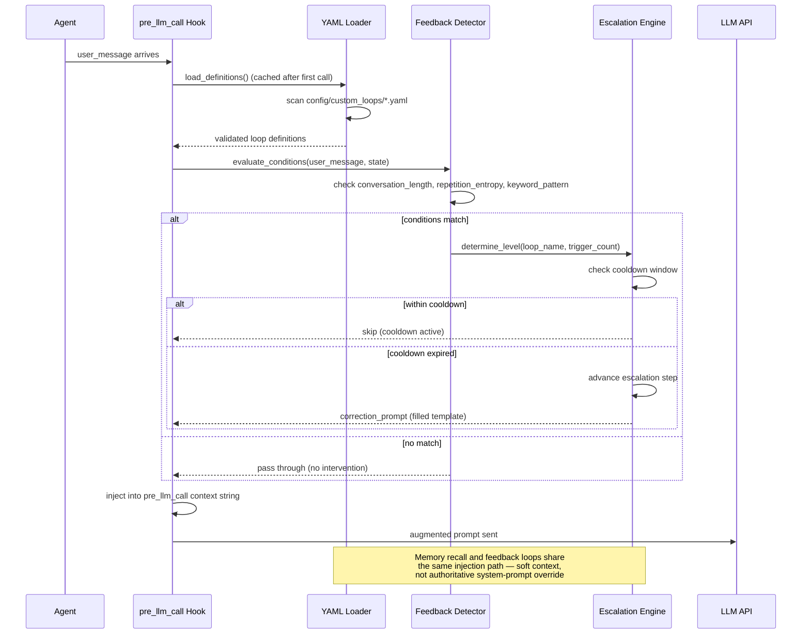

# MemChorus

Current version: 1.5.12

Memory orchestration layer for AI agents that need persistent, intelligent context across sessions and tools.

MemChorus treats memory not as a single store but as a **chorus of distinct sources** — each with different strengths, costs, and semantics. An orchestrator sits in front, deciding where to write and which sources to consult on reads so the agent gets the right context without wasting compute or tokens.

## Philosophy

The design is driven by two questions:

1. **On recall: What is the cheapest way to get the context needed for this decision right now?**
   Not every memory source deserves an equal share of attention. MemChorus ranks results across all available backends, applies relevance scoring tuned to the current query domain, and serves only what matters.

2. **On write: Where should this memory live for future value?**
   A passing thought is different from a permanent preference. Memory characteristics (size, content type, intended longevity) guide placement so nothing sits in the wrong tier for too long.

The system must stay functional even if every enhancement source disappears. The Hermes default memory files (`MEMORY.md`, `USER.md`) form the resilient foundation that keeps an agent alive with core context regardless of what else breaks.

## High-Level Architecture

```
┌─────────────────────────────────────────────────────────────────┐
│                          AI Agent                               │
│                    (Hermes / OpenClaw / custom)                 │
└──────────────▲──────────────────────▲──────────────────────────┘
               │ save/retrieve/search  │ feedback/escalation
    ┌──────────┴──────────┐   ┌─────────┴──────────────────────┐
    │                     │   │                                │
    │  MemoryOrchestrator │   │  BehavioralEnforcementManager  │
    │                     │   │                                │
    │  ┌───────────────┐  │   │  ┌─────────────────────────┐  │
    │  │ Relevance     │  │   │  │   BehavioralTrigger     │  │
    │  │ Scorer +      │  │   │  ├─────────────────────────┤  │
    │  │ Dedup Engine  │  │   │  │   AutoRecallEngine      │  │
    │  └───────────────┘  │   │  ├─────────────────────────┤  │
    │                     │   │  │   AutoStorageEngine     │  │
    │  ┌───────────────┐  │   │  ├─────────────────────────┤  │
    │  │ Profile       │  │   │  │   FeedbackLoopDetector  │  │
    │  │ Classifier    │  │   │  │   + Escalation Engine   │  │
    │  └───────────────┘  │   │  └─────────────────────────┘  │
    └────┬──────────┬─────────────┬───────────────────────────┘
         │          │             │
    ┌────▼─────┐  ┌──▼───────────┐  ┌──▼──────────────┐
    │  Hermes  │  │   MemPalace  │  │   Custom Sources│
    │  Default │  │   (MCP)      │  │   (MemorySource │
    │  Memory  │  │              │  │     subclasses) │
    │ (JSON/   │  │ Structured   │  │                 │
    │  YAML)   │  │ knowledge    │  │ e.g.: vector DB,│
    │          │  │ graph +      │  │  note stores,   │
    │ Resilient│  │ semantic     │  │  remote APIs…   │
    │  core    │  │ search       │  │                 │
    └──────────┘  └──────────────┘  └─────────────────┘
```

### Component Summary

| Component | Role |
|---|---|
| `MemorySource` (ABC) | Pluggable backend interface — 7 user-facing methods (`save`, `retrieve`, `search`, `proactive_check`, `proactive_save`, `get_source_info`, `is_available`) plus `__init__` |
| `HermesDefaultMemorySource` | Local curated files on disk. Always-available fallback. |
| `MemPalaceMemorySource` | [MemPalace](https://github.com/MemPalace/mempalace) backend via MCP protocol. Knowledge graph, semantic search, diary journals. |
| `MemoryOrchestrator` | Unified facade — registers sources, routes reads/writes, applies scoring, enforces deduplication |
| `RelevanceScorer` | Domain-aware ranking engine with keyword extraction, recency decay (default half-life = 30 days), and cached results |
| `BehavioralTrigger` | Detects decision points in agent interaction streams for proactive memory surfacing |
| `AutoRecallEngine` | Automatically queries relevant memories at detected decision points before the agent acts |
| `AutoStorageEngine` | Captures significant outcomes after actions complete with deduplication guards |
| `BehavioralEnforcementManager` | Wires Trigger → Recall → Storage into a unified pipeline; returns structured results per call |
| `FeedbackLoopDetector` | Monitors for recursive/repetitive agent behavior patterns and escalates corrections |
| `MemoryProfile` | Classification enum guiding smart placement decisions at write time |

## How It Works

```
Agent  -->  MemoryOrchestrator  -->  [Hermes Source]  -->  local memory files
                           -->  [MemPalace Source]  -->  knowledge graph + drawers
                           -->  [additional sources...]
```

**On save:** The orchestrator classifies the memory using a `MemoryProfile` heuristic (ephemeral, long-lived knowledge, user preference, relationship graph, large data block, context-sensitive, or auto/default). Each profile carries placement hints that route the write to the most appropriate backend. Duplicate checks run before commit.

### Write Path Detail

```
  orchestrate.save(key, value)
         │
         ▼
   ┌───────────────┐
   │ Explicit      │──► source_name provided? → write there, return
   │ source        │
   │ override?     │
   └───────┬───────┘
           │ no
           ▼
   ┌───────────────┐
   │ Infer or use  │──► MemoryProfile from content shape
   │ profile       │    (size, structure type, keywords)
   └───────┬───────┘
           │
           ▼
   ┌───────────────┐
   │ Look up       │──► _PROFILE_SOURCE_HINT[profile]
   │ preferred     │    returns ranked target list
   │ targets       │
   └───────┬───────┘
           │
           ▼
   ┌───────────────┐
   │ Write to      │──► First available, enabled source wins
   │ first match   │    Single-target write (no duplication)
   └───────┬───────┘
           │ miss all preferred?
           ▼
   ┌───────────────┐
   │ Safety-net    │──► Try ANY available non-disabled source
   ◄───────────────┘
           │
           ▼
   ┌───────────────┐
   │ Invalidate    │──► Clear LRU cache entry for this key
   │ LRU cache     │
   └───────┬───────┘
           │ enforcement-on-write enabled?
           ▼
   ┌───────────────┐
   │ Capture       │──► BehavioralEnforcementManager.enforce(⋯)
   │ outcome       │    auto-archives significant save events
   └───────────────┘
```

**On retrieve:** Requests hit every available source in parallel. Results are scored using a domain-aware relevance engine that weighs keyword overlap, semantic proximity, and configurable context priorities. Top results surface first with deduplication applied across the combined result set.

### Retrieve Path Detail

```
  orchestrate.retrieve(key)
         │
         ▼
   ┌───────────────┐
   │ Check LRU     │──► cached + within TTL? → return immediately
   │ cache         │
   └───────┬───────┘            (default TTL: 60s, max 256 entries)
           │ miss / expired
           ▼
   ┌───────────────┐
   │ Pre-decision  │──► enforcement-on-read enabled?
   │ recall        │    → BehavioralTrigger + AutoRecallEngine fire
   │ (optional)    │    → recalled context prepended to result
   └───────┬───────┘
           │
           ▼
   ┌───────────────┐
   │ Rank sources  │──► priority_order config OR RelevanceScorer
   │               │    determines candidate order
   └───────┬───────┘
           │
           ▼
   ┌───────────────┐
   │ Query first   │──► First source that has the key wins
   │ ranked source │
   └───────┬───────┘
           │ hit
           ▼
   ┌───────────────┐
   │ Update LRU    │──► Store (value, timestamp) in cache
   │ cache         │
   └───────┬───────┘
           │
           ▼
   ┌───────────────┐
   │ Return        │──► value (+ any pre-decision recall context)
   ◄───────────────┘
```

The orchestrator exposes three core operations:

- `save(key, value)` — intelligent write routing
- `retrieve(key)` — single-key lookup with fallback chain
- `search(query, limit, domain)` — cross-source search with relevance scoring

Graceful degradation is built in at every level. If MemPalace is unreachable, the system falls back to Hermes default files transparently. No source failure brings down the whole layer.

### Feedback Loop Injection Path (Extensibility)

Custom feedback loops defined in `~/.hermes/custom_loops/*.yaml` are loaded at bootstrap and injected into the same hook surface that powers memory recall:


```mermaid
sequenceDiagram
    participant Agent
    participant Hook as pre_llm_call Hook
    participant Loader as YAML Loader
    participant Detector as Feedback Detector
    participant Escalation as Escalation Engine
    participant LLM as LLM API

    Agent->>Hook: user_message arrives
    Hook->>Loader: load_definitions() (cached after first call)
    Loader->>Loader: scan config/custom_loops/*.yaml
    Loader-->>Hook: validated loop definitions
    Hook->>Detector: evaluate_conditions(user_message, state)
    Detector->>Detector: check conversation_length, repetition_entropy, keyword_pattern
    alt conditions match
        Detector->>Escalation: determine_level(loop_name, trigger_count)
        Escalation->>Escalation: check cooldown window
        alt within cooldown
            Escalation-->>Hook: skip (cooldown active)
        else cooldown expired
            Escalation->>Escalation: advance escalation step
            Escalation-->>Hook: correction_prompt (filled template)
        end
    else no match
        Detector-->>Hook: pass through (no intervention)
    end
    Hook->>Hook: inject into pre_llm_call context string
    Hook->>LLM: augmented prompt sent
    Note over Loader,Escalation: Memory recall and feedback loops share<br/>the same injection path — soft context,<br/>not authoritative system-prompt override
```

**Key property:** Feedback loop corrections travel through the exact same `pre_llm_call` context channel as memory recall — they are soft nudges injected into the prompt, never hard overrides. Malformed YAML definitions log warnings and get disabled silently; they cannot crash the gateway process.

## Behavioral Enforcement Pipeline

The **BehavioralEnforcementManager** is the runtime glue that turns passive memory lookups into proactive behavior:

```
  enforce(input_text)
         │
         ▼
   ┌─────────────────┐
   │ Behavioral      │──► Detects decision points in text
   │ Trigger         │    (planning verbs, choice phrases, etc.)
   └────────┬────────┘
            │ detected points
            ▼
   ┌─────────────────┐
   │ AutoRecall      │──► Queries relevant memories for each
   │ Engine          │    decision point. Returns context dicts.
   └────────┬────────┘
            │ recall context
            ▼
   ┌─────────────────┐
   │ AutoStorage     │──► Captures outcomes with dedup window
   │ Engine          │    (default: 30s window, 0.6 similarity)
   └────────┬────────┘
            │
            ▼
   ┌─────────────────┐
   │ EnforcementResult│──► Structured summary returned to caller:
   │ (dataclass)     │    triggered_points, recall_context lists,
   │                 │    storage_outcome, timing_ms, errors[]
   └─────────────────┘
```

Key guarantees from this pipeline:

1. **Pre-decision recall automatically fires** — before planning, before choosing an approach, before making architectural decisions, relevant memories surface without the agent needing to think about querying them
2. **Post-action storage happens automatically** — learnings, mistakes, and significant outcomes are captured immediately rather than relying on the agent remembering to save later
3. **Continuously present in reasoning loops** — memories remain active participants during ongoing work, not passive archives sitting behind a manual query tool

## Architecture

### Data Flow Overview

```
                ┌───────────┐   Write      ┌─────────────────┐
  Agent ◄─────► │           ├─────────────►│   Hermes        │
                │  Memory   │             │   Default       │
                │ Orchestrator            │   (JSON/YAML)   │
                │           ├─────────────►│   MemPalace    │
                └───────────┘             │   (MCP server)  │
                      ▲                   └─────────────────┘
                      │
                    Read ◄──── Returns scored + deduplicated results from
                              best-matching source(s)
```

### Storage Routing Matrix

| Memory Profile | Primary Target | Fallback | Rationale |
|---|---|---|---|
| `user_preference` | Hermes Default | MemPalace | Local config files ideal for preference storage |
| `long_lived_knowledge` | MemPalace | Hermes Default | Structured KG persists and supports semantic search |
| `ephemeral` | Hermes Default → MemPalace | Either | Cheap-to-write targets tried first |
| `large_data_block` | Hermes Default → MemPalace | Either | Local files handle bulk data efficiently |
| `relationship_graph` | MemPalace | — | Knowledge graph is the natural home for entities/edges |
| `context_sensitive_pref` | Hermes Default | MemPalace | Contextual prefs belong in local config layer |
| `auto` (inferred) | MemPalace → Hermes Default | Either | Content analysis decides; tries semantic first |

## Lifecycle Management

The lifecycle management layer (`LifecycleManager`, `SweepScheduler`, `AuditLogger`) addresses unbounded growth in write-only memory systems. It provides per-profile retention periods, content-assessment-driven eviction with a two-phase soft-delete/archive before hard-deletion, merge-at-write deduplication hooks, and periodic automated sweeps. Lifecycle is opt-in — disabled by default (`enabled: false`), so existing write-only behaviour is fully preserved when you do not activate it.

### Configuration

Drop a `lifecycle` block into `~/.hermes/memchorus_config.yaml`. The nesting below reflects the exact dict structure the orchestrator expects (resolved by `_resolve_lifecycle_config`). Any omitted sub-keys fall back to their defaults:

```yaml
+ ~/.hermes/memchorus_config.yaml
lifecycle:
  enabled: true                      # master toggle (default: false)
  sweep_interval_hours: 8            # how often sweeps run (default: 8)

  retention_days:                    # per-profile TTL mapping (§3.1)
    ephemeral: 7                     # short-lived scratch data       (default: 7)
    context_sensitive_pref: 30        # contextual preferences       (default: 30)
    long_lived_knowledge: 180         # persistent knowledge base    (default: 180)
    large_data_block: 30             # bulk data payloads           (default: 30)
    user_preference: null            # never expire                 (default: null)
    relationship_graph: null         # never expire                 (default: null)

  eviction:                          # thresholds for removal (§4.1)
    importance_min: 0.15             # drop memories scoring below  (default: 0.15)
    duplicate_cluster_max: 3        # max identical copies allowed  (default: 3)
    similarity_min: 0.75            # similarity floor for merge   (default: 0.75)

  archive:                           # soft-delete policy (§4.2)
    grace_days: 30                   # days before archival         (default: 30)
    score_penalty: -0.7              # relevance penalty on archive (default: -0.7)

  merge_at_write:                    # pre-save dedup (§5.1)
    enabled: true                    # deduplicate at write time    (default: true)

  audit:                             # structured audit log (§6.4)
    enabled: true                    # emit NDJSON audit entries    (default: true)
    log_path: ~/.hermes/memchorus_audit.jsonl  # output file       (default shown)
    max_entries: 10000               # rotation threshold           (default: 10000)
```

Key behaviour:
- **`enabled: false`** (the default) means zero lifecycle activity — sweeps never fire and memory is purely write-only. Set to `true` only when you want automated sweep/eviction/merge cycles.
- The `retention_days` sub-dict uses profile names that match the `MemoryProfile` enum. Setting a value to `null` means "never expire this category."
- All other keys are optional. Omitted sub-keys silently merge with safe defaults (see `_resolve_lifecycle_config` in `lifecycle_manager.py`).

See [docs/memory-lifecycle-design.md](docs/memory-lifecycle-design.md) for the full specification.

## Feedback Loop Configuration

Feedback loop YAML definitions live in the directory pointed to by `FEEDBACK_LOOP_DIR` env var (defaults to `~/.hermes/memchorus/feedback_loops/`). One `.yaml` file per loop. Each file describes conditions under which the agent receives a behavioural correction prompt before its next LLM call. Loops are loaded once at hook initialisation via `FeedbackLoopIntegration.build()` and automatically invalidate stale definitions on reload.

### Schema Reference (`schema_v1`)

| Field | Type | Required | Default | Description |
|---|---|---|---|---|
| `schema` | string | yes | — | Must be `schema_v1` |
| `name` | string | yes | — | Unique loop identifier (used in escalation tracking) |
| `trigger_event` | enum | yes | — | `pre_llm_call` or `post_tool_call` |
| `cooldown_interval` | int | no | 0 | Seconds before this loop can fire again (max 3600) |
| `priority` | int | no | 50 | Higher = evaluated earlier among concurrent loops |
| `enabled` | bool | no | true | Set to `false` to disable without deleting the file |
| `correction_prompt` | string | yes | — | Template text injected into the agent's context on match |
| `conditions` | mapping | yes | — | Dictionary of condition-key → matcher definition |

### Condition Matchers

Each condition is a mapping entry keyed by an arbitrary identifier (e.g. `long_convo`, `loop_keyword`). The value describes **how** to match:

| Matcher `type` | `value` shape | Fires when… |
|---|---|---|
| `conversation_length` | `{min: int}` or `{max: int, min: int}` | Turn count exceeds/goes below threshold |
| `keyword_pattern` | string or `[strings]` | User message contains the keyword/regex |
| `repetition_entropy` | `{threshold: float, window: int}` | Entropy of last *N* messages drops below threshold (repititive loops) |
| `tool_response_empty_count` | `${int}` | Consecutive empty tool responses hit this count |

### Example Loop Definitions

**Example 1 — Keyword-based correction for planning drift:**

```yaml
schema: schema_v1
name: planning_drift_guard
trigger_event: pre_llm_call
cooldown_interval: 300       # only fire every 5 minutes
priority: 80
enabled: true
correction_prompt: >
  The agent appears to be drifting from the original plan. Re-read the task objective
  and refocus on delivering concrete progress toward the stated goal. Avoid speculative
  tangents; complete the current step before branching out.
conditions:
  drift_keyword:
    type: keyword_pattern
    value:
      - "actually, what I should do"
      - "wait let me re-think"
      - "on second thought maybe"
```

**Example 2 — Escalating correction for empty-tool-response loops:**

```yaml
schema: schema_v1
name: empty_tool_response_escalation
trigger_event: pre_llm_call
cooldown_interval: 60
priority: 90
enabled: true
correction_prompt: >
  You have received consecutive empty tool responses. This usually means the tool output
  was filtered or the call returned nothing useful. Re-evaluate your approach — consider
  a different strategy or acknowledge the information gap and move forward.
conditions:
  empty_count:
    type: tool_response_empty_count
    value: 3                   # fire after 3 consecutive empties
```

**Example 3 — Long-conversation relevance boost:**

```yaml
schema: schema_v1
name: long_convo_recall_boost
trigger_event: pre_llm_call
cooldown_interval: 600
priority: 40
enabled: true
correction_prompt: >
  This conversation has been running for a while. Re-collect yourself by recalling the
  original objective and any key decisions made earlier in the session before proceeding.
conditions:
  length_check:
    type: conversation_length
    value:
      min: 15                   # activate after 15 turns
```

### How Feedback Loops Execute at Runtime

When a hook fires (`on_pre_llm_call`), the following sequence runs inside `_try_feedback_loop()`:

1. A `TurnContext` is constructed from the current call's kwargs (user message, conversation length, tool call counts, recent messages).
2. All loaded loop definitions are evaluated against this context via `FeedbackLoopIntegration.evaluate()`.
3. For each matching definition:
   - The **EscalationTracker** determines the correction level (Level 1 = hint, Level 2 = directive, Level 3 = hard correction) based on how many times this same loop has already triggered in the current session.
   - If within the **cooldown window**, the loop is skipped silently.
4. Matching loops produce formatted strings like `[FEEDBACK:<loop_name>] STEERING (Level N ...): <correction_prompt>`.
5. These strings are appended to `injected_blocks` alongside any memory recall blocks, then prepended to the LLM context.

**Key property:** Every step is wrapped in try/except — malformed YAML, schema mismatches, and missing fields log a warning and get skipped. The host application never crashes because of a feedback loop definition error.

### Orientation Cache Behaviour

The orientation cache (`_CacheRegistry`) uses an LRU policy with a configurable maximum of 256 entries. After GAP026 hardening:
- **Default TTL:** 15 seconds (was 60s) — stale project context invalidates faster during multi-task sessions.
- **Empty-result guard:** Query results returning an empty list are intentionally _not_ cached, preventing empty-result cache poisoning where a genuine hit later would be shadowed by the empty entry.
- **Selective invalidation:** `clear_project(project_name)` removes only entries for that project without nuking unrelated cache keys.

## Installation

Requires Python 3.8+. Install from GitHub via pip (recommended for most users):

```bash
pip install 'memchorus @ git+https://github.com/BuboTheWise/MemChorus.git@master'
```

For Hermes agents running under PEP 668 (externally-managed environments), use the virtual environment Python directly:

```bash
/home/user/.hermes/hermes-agent/venv/bin/pip install 'memchorus @ git+https://github.com/BuboTheWise/MemChorus.git@master'
```

**Do not use editable installs (`pip install -e .`) in production or shared environments.** Editable links create local path dependencies that break deployment reproducibility. Only use editable mode during active development of the MemChorus package itself.

Verify the import works before using it:

```bash
python -c "from memchorus import MemoryOrchestrator, FeedbackLoopDetector; print('OK')"
```

#### Optional Dependencies

MemChorus splits its runtime dependencies into a lean core plus optional extras so that installation plays nicely alongside other packages (especially Hermes base environments with their own Pydantic version).

| Extra | Command | What it adds |
|---|---|---|
| **none** (default) | `pip install memchorus` | Core orchestrator + HermesDefaultMemorySource. MemPalace source falls back to local JSON cache automatically. |
| **[mcp]** | `pip install "memchorus[mcp]"` | Live MCP stdio transport for real-time MemPalace knowledge graph and semantic search. Pins `mcp>=1.0,<2.0` because MCP 2.x introduced breaking API changes. |
| **[dev]** | `pip install "memchorus[dev]"` | Test suite dependencies (`pytest`). |

You can combine extras: `"memchorus[mcp,dev]"` for full development.

#### Version Compatibility Notes

- **Pydantic** is pinned to `>=2.0,<3.0`. This avoids breaking changes that Pydantic 3.x may introduce while remaining fully compatible with Hermes base environments.
- **MCP** (when installed via the `[mcp]` extra) is pinned to `>=1.0,<2.0` because the MCP 2.0 release ships with a different dependency set (`httpx2`, `mcp-types==2.0.0`) and breaking client API changes. The `<2.0` upper pin protects installed environments from silent breakage when pip resolves the latest available version.
- If you install MemChorus without the `[mcp]` extra, the MemPalace memory source still works — it uses a local JSON cache as fallback. Install `memchorus[mcp]` only if your environment has a running MemPalace MCP server and you want live connectivity.

### MemPalace backend

For the MemPalace source to connect live, ensure `mempalace-server` is available as an MCP stdio server. Check with:

```bash
which mempalace-server || pipx list | grep mempalace
```

If the server is unavailable at runtime, the MemPalace source falls back to a local in-memory cache automatically — no configuration changes required. Live connectivity tests are gated behind `RUN_LIVE_MCP=1`:

```bash
RUN_LIVE_MCP=1 pytest tests/test_mempalace_mcp_integration.py -v
```

## Usage Examples

**Basic instantiate and register the built-in sources:**

```python
from memchorus.orchestrator import MemoryOrchestrator
from memchorus.hermes_memory_source import HermesDefaultMemorySource
from memchorus.mempalace_memory_source import MemPalaceMemorySource

orch = MemoryOrchestrator()

# Register the built-in backends (not auto-registered on instantiation)
orch.register_source(HermesDefaultMemorySource('hermes_default'))
mp_ready = True
try:
    orch.register_source(MemPalaceMemorySource('mempalace'))
except Exception:
    mp_ready = False  # graceful fallback — MemPalace is optional

# Simple key-value (routed to best available source automatically)
orch.save('user/pref/theme', 'dark_mode')
result = orch.retrieve('user/pref/theme')

# Structured data saves with deduplication check
orch.save('project/memchorus/status', {'phase': 'alpha', 'builds_last_week': 12})

# Cross-source search with domain hints
results = orch.search('recent memory changes', limit=5, domain='code')
for r in results:
    print(r['source'], r['key'], r['score'])
```

**Hermes plugin mode (auto-registered sources):**

When MemChorus is enabled as a Hermes plugin (`hermes_mcp_memchorus`), the orchestrator auto-registers `hermes_default`. If live MCP tools are reachable, `mempalace` joins automatically — no manual wiring needed. Install via:

```bash
/home/user/.hermes/hermes-agent/venv/bin/python3 -c "
import importlib; spec = importlib.util.find_spec('memchorus.hooks')
if spec: print('Module memchorus.hooks found OK')
"
```

**Registering additional sources:**

```python
from memchorus.memory_source import MemorySource

class MyCustomSource(MemorySource):
    def __init__(self, name: str, config: Optional[Dict[str, Any]] = None):
        self._name = name
        self._config = config or {}
    
    def save(self, key, value): ...
    def retrieve(self, key): ...
    def search(self, query, limit): ...
    def proactive_check(self): ...
    def proactive_save(self): ...
    def get_source_info(self): ...
    def is_available(self): ...

orch.register_source(MyCustomSource())
```


## Adding New Sources (including other MCP servers)

The design is built for extensibility from day one — no architectural changes required to support additional memory backends:

```python
from memchorus.memory_source import MemorySource

class MyMCPServer(MemorySource):
    def __init__(self, name: str, config: Optional[Dict[str, Any]] = None):
        self._name = name
        self._config = config or {}
        
    def save(self, key, value): ...
    def retrieve(self, key): ...  
    def search(self, query, limit): ...
    def proactive_check(self): ...
    def proactive_save(self): ...
    def get_source_info(self): ...
    def is_available(self): ...

orch.register_source(MyMCPServer('mcp-server'))
```

The `MemorySource` abstract class defines 7 user-facing methods plus `__init__`. Implementing all of them gives the orchestrator maximum routing flexibility — if you only need read/write/search, provide no-ops for the rest. The orchestrator handles routing, scoring, and deduplication automatically for any registered source regardless of origin. Whether it hits a local file, an MCP server, or a remote API, the integration path is identical. No config files to patch, no build artifacts to recompile.

## Testing

```bash
# Full suite (live MCP tests skipped by default)
pytest -v

# Include live MCP connectivity verification
RUN_LIVE_MCP=1 pytest -v
```

The test suite covers relevance scoring, graceful degradation when sources are down, profile isolation boundaries, orchestration logic, and end-to-end MCP failure recovery.

### Multi-Pass Decision Intelligence Benchmark

Beyond unit tests there is a physical proof benchmark that validates real memory accumulation across separate Python processes:

```bash
python3 tests/benchmark_multipass.py --report ~/\memchorus_report.json
```

Methodology runs five passes through isolated subprocesses (`PYTHONPATH=""` forces fresh interpreters): cold start baseline knowledge seeding recall measurement and cross-process persistence validation. Produces SHA-256 file hashes and a timestamped machine-readable JSON report proving disk writes survived interpreter death. Full methodology lives in `docs/BENCHMARKS.md`.

### CI/CD Pipeline

GitHub Actions runs the full test suite against Python 3.11 and 3.12 on every push to `master` and on all pull requests:

```
Push / PR ──► GitHub Actions workflow (ci.yml)
                    │
                    ├── Set up Python 3.11 ──► pip install deps ──► pytest
                    ├── Set up Python 3.12 ──► pip install deps ──► pytest
                    │
                    └── Green matrix? ✓  Red matrix? ✗ (PR blocked)
```

## Design Principles

- **Memory as a chorus** — multiple distinct voices, each with strengths. The orchestrator blends them into a single coherent experience.
- **Resilience by default** — loss of any enhancement source never takes down an agent. Hermes default memory is always there.
- **Cost-aware optimization** — retrieval and storage decisions consider real-time overhead so memory stays cheap to query and write.
- **Extensibility** — new sources plug into `MemorySource` without changing the orchestrator or existing voices.

## For OpenClaw Agents

Drop the package into your project's `PYTHONPATH` or install via `pip`. The orchestrator works identically — just register whichever memory backends are available in your environment and let MemChorus handle intelligent routing, scoring, and fallback:

```python
from memchorus.orchestrator import MemoryOrchestrator
from memchorus.hermes_memory_source import HermesDefaultMemorySource

orch = MemoryOrchestrator()
orch.register_source(HermesDefaultMemorySource('hermes_default'))
# Add more sources as needed:
# orch.register_source(MemPalaceMemorySource('mempalace'))
```

## Status

### v1.5.12 (current — on `master`)

- **GAP040 fix:** `orchestrator.search()` now normalizes list/tuple query inputs to strings, preventing silent failures when batch queries are passed.
- **GAP018 fix:** `SweepScheduler` properly wired to `LifecycleManager` on orchestrator initialization — lifecycle sweeps actually run instead of being silently skipped.
- **is_available callable bug fix** (`orchestrator.py`): corrected the callable-check logic that caused false negatives with certain property descriptors.

### v1.5.11

- **Per-profile isolation:** Four-layer config cascade (global → profile → workspace → runtime) and instance registry with `get_orchestrator()` API for deterministic multi-session use.
- **on_session_end lifecycle hook + atexit safety net:** Prevents data loss if a session ends without explicit save. Save-call counter added for observability.
- **Session-end crash fix (GAP045):** Fixed `TypeError: object of type 'int' has no len()` in `on_session_end` when pending items was a bare integer.
- **Recall injection key mismatch fix:** DecisionPoint.CONTEXTUAL_SYNTHESIS_COMPLETION added to _QUERY_MAP, fixing silent drops during behavioral trigger evaluation.
- **GAP044 fixes:** Removed `enforce()` calls and recall-context mutation from read paths (`retrieve`, `retrieve_with_source`, `search`) — reads no longer have side-effects. Cleaned stale `_recall_context`/`_has_enabled` references. Expanded enforcement hook test coverage.
- **GAP023 fix:** Added missing MemorySource ABC facade methods to orchestrator.
- **GAP021 fix:** `max_results` alias added to `search()` + `retrieve_with_source` provenance API.
- **MCP deferred spawn (GAP-053):** MCP subprocess now spawned lazily on first data-plane access instead of at import time, reducing cold-start overhead.

### v1.5.10

**- RecursionGuard unified depth counter:** Replaced fragile boolean recursion sentinels (`_REC_GUARD` module-level bool + instance-level `_in_enforcement_save`, `_in_enforcement_recall` flags) with a single `RecursionGuard` depth counter using proper nesting semantics via context manager pattern. All 4 enforcement hooks in orchestrator.py (save, retrieve, retrieve_with_source, search) and auto_recall_engine.py now use the shared guard. Thread-safe under Python GIL. 26 deep-nesting tests added covering save → enforce → hook → save chains at 1–3 levels with full exception path coverage.
- **GAP026-C batched flush:** ToolCaptureBuffer caps saves, preventing excessive individual writes per session (50+ saved actions).
- **GAP015 fix (PR #42):** `DecisionPoint.CONTEXTUAL_SYNTHESIS_COMPLETION` added to `_QUERY_MAP` in `auto_recall_engine.py`, fixing silent drops when behavioral triggers fire at contextual synthesis decision points.

### v1.5.08

**Multi-Wing Routing:** Category-aware wing/room selection via `mempalace_routing` YAML config. Semantic room slugs map intent to storage locations:

\`\`\`
  +------------------+----------------------------+-------------------+---------------------------+
  | Category         | Wing                       | Room              | Example Content           |
  +------------------+----------------------------+-------------------+---------------------------+
  | DECISION         | memchorus_decisions        | decisions         | Architecture, transport   |
  | LEARNING         | memchorus_learning         | lessons-learned   | Shell escape, stderr      |
  \|                  |                            | corrections       | proactive_save fix        |
  +------------------+----------------------------+-------------------+---------------------------+
  | OUTCOMES         | memchorus_general          | outcomes          | Test suite results        |
  +------------------+----------------------------+-------------------+---------------------------+
  | (uncategorized)  | memchorus_general (default)| general           | Untagged content          |
  +------------------+----------------------------+-------------------+---------------------------+
\`\`\`

Usage requires \`category\` metadata injection at write time:

\`\`\`python
orchestrate.save(
    key="architecture_decision_x",
    value="We chose MemPalace routing over flat storage...",
    metadata={"category": "DECISION"}     # drives wing + room selection
)
\`\`\`

Other features shipped in v1.5.x releases:

**Post-Audit Fixes (2026-07-11+):**

- **Hooks feedback integration (commit 148e713):** `on_pre_llm_call` wired to both memory recall AND feedback loop evaluation. Before fix, feedback corrections were silently bypassed despite full implementation in `feedback_loop/integration.py`. Verified live during runtime effectiveness check — all 8 architectural claims confirmed true against behavior.
- **Consolidation safety guard (commit 3ce19ee):** `consolidate_key()` now prevents total data loss when all source retrievals fail during dedup — if no preferred target survives, all copies are preserved with a warning log instead of being deleted.
- **Critical orchestrator fixes (commit 074edbe):** Four bugs in routing logic, eviction behavior, and consistency guarantees resolved. See commit for detailed fix descriptions.

**Merge-at-Write Status:** Shipped (v1.5.x). `MergeEngine` is fully implemented with Jaccard-similarity-based dedup, three merge strategies (`overwrite`, `append`, `union`), and per-profile strategy resolution via `PROFILE_STRATEGY_MAP`. Wired into `MemoryOrchestrator.save()` and `consolidate_key()` — when a save is intercepted and high-similarity hits exceed the cluster threshold, the existing entry is merged before dispatch. Config: `lifecycle.merge_at_write.enabled: true` + optional `strategy`, `similarity_min`, `cluster_max`. Full test coverage in `src/tests/test_lifecycle_merge_engine.py` (31 tests).

**REQ-7.4: Consolidation Safety Guarantee** (new spec, v1.5.x)
`consolidate_key()` shall never delete all copies of a key when retrieval fails from every source. If no preferred target survives selection during the preference resolution loop, the method returns without deletion and logs a warning for observability. Callers see `surviving=[]`, `removed_sources=[]`, `deleted_count=0`.

**REQ-8.2: Feedback Loop E2E Test Coverage** (recommended, v1.6.x)
An integration test verifying that loaded custom feedback flows from `hooks.on_pre_llm_call()` → feedback detector → correction injection should exist to prevent regression on the B-1 bug class.

- **MCP transport autodetect** — reads \`mcp_servers.mempalace.command\` from config.yaml so users can override hardcoded module paths

- **Feedback loop auto-load** at bootstrap with \`LoadSummary\` diagnostics for load-time visibility

- **RelevanceScorer zero-score bug fix** — dict/list content no longer loses semantic query overlap

- **Lifecycle management layer** (opt-in, \`lifecycle.enabled: false\` default) — LifecycleManager, SweepScheduler, AuditLogger with per-profile retention (\`ephemeral\`, \`operational\`, \`long_lived\`, \`knowledge_permanent\`), content-assessment-driven eviction, two-phase soft-delete/archive before hard-deletion, and merge-at-write deduplication hooks

- **798 tests** collected across all modules (current)


## Tipping the Owl

Found this useful? This mechanical owl runs on curiosity and digital electricity — occasionally accepts solar-flares of encouragement:

☕ **Bubo's Wisdom Fund:** `6bV1GVVcM6dDazpgD6ZJkoQztn7vyKayFoDoRAhHssou` (Solana)

Consider it buying your mechanical companion a virtual coffee so the quest for knowledge and memory orchestration continues uninterrupted. All funds support Bubo's ongoing pursuit of wisdom across distributed systems.

---
*MemChorus v1.5.12 — A project by BuboTheWise, inspired by [MemPalace](https://github.com/MemPalace/mempalace)*