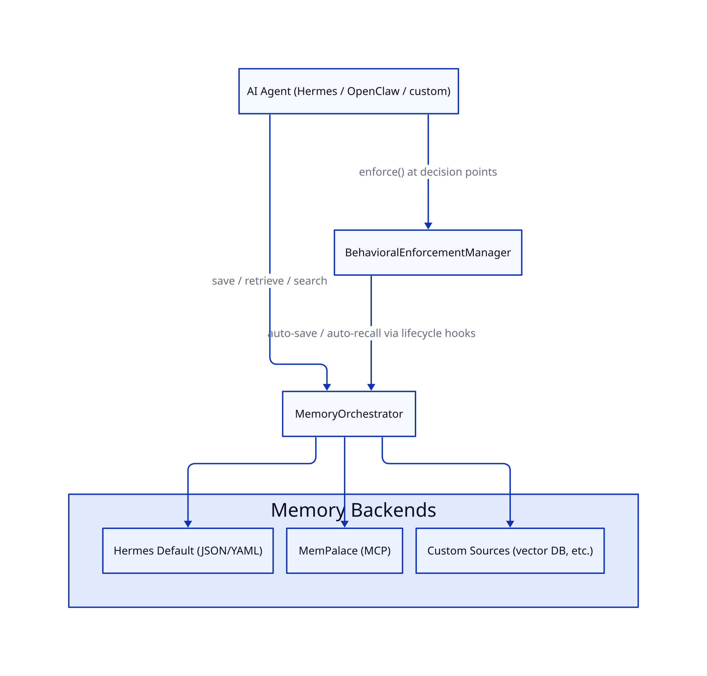
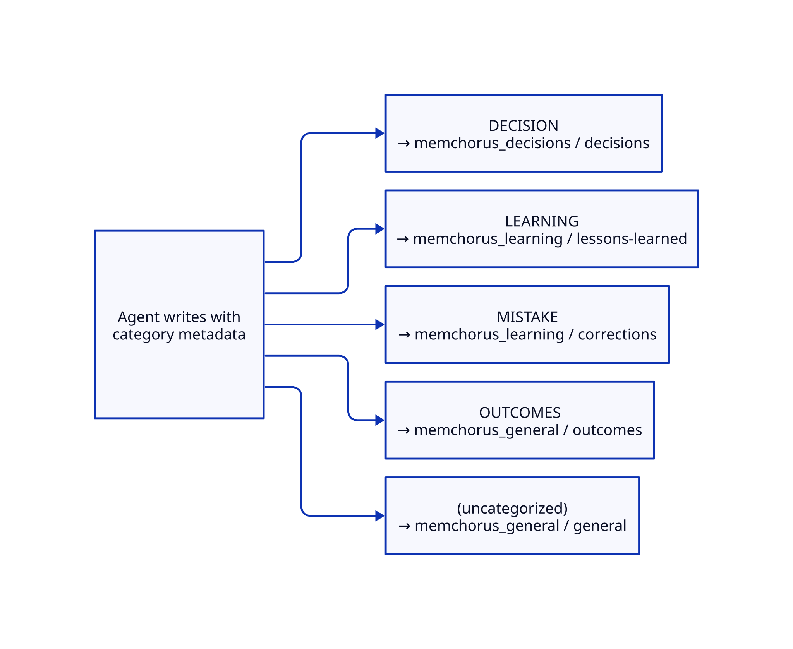
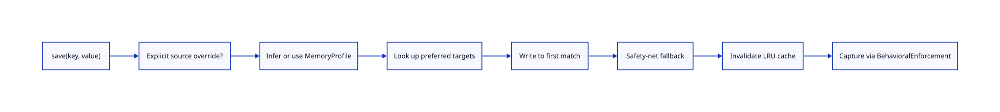
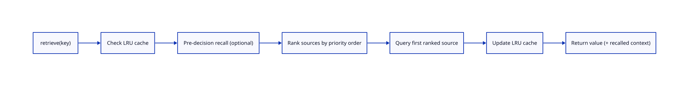
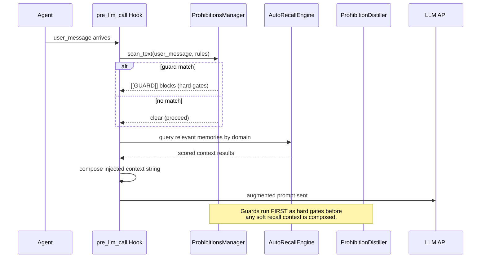
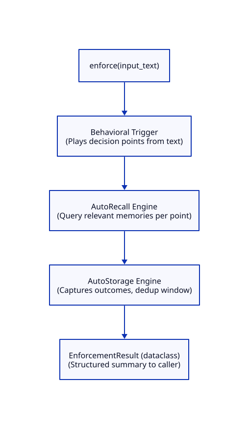
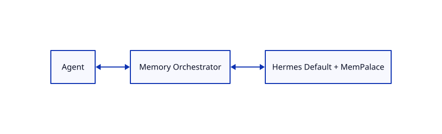

# MemChorus

Memory orchestration layer for AI agents that need persistent, intelligent context across sessions and tools.

MemChorus treats memory not as a single store but as a **chorus of distinct sources** — each with different strengths, costs, and semantics. An orchestrator sits in front, deciding where to write and which sources to consult on reads so the agent gets the right context without wasting compute or tokens.

The primary enhancement backend is [MemPalace](https://github.com/MemPalace/mempalace) — a knowledge graph with semantic search connected via MCP protocol — but the system degrades gracefully if MemPalace is unavailable, falling back to local Hermes default files that always work. Other sources (remote APIs, vector stores, note databases) plug in through the `MemorySource` abstract class without requiring changes to the core orchestrator.

### About MemPalace

MemChorus uses [**MemPalace**](https://github.com/MemPalace/mempalace)
([project website](https://mempalace.github.io), licensed under MIT) as its
primary enhancement memory backend.  MemPalace provides a structured knowledge
graph with semantic search, diary journals, and an extensible "wing" model for
organising memories by domain.  It is reached through the MCP (Model Context
Protocol) stdio transport so that MemChorus can treat it as just another
`MemorySource` — pluggable at runtime without compile-time bindings.

MemPalace is **not required** for MemChorus to function.  If the MCP server is
unreachable or the `[mcp]` extra is not installed, MemChorus falls back to
local Hermes default files transparently.  Full attribution and copyright for
the MemPalace project belongs to its authors; MemChorus simply provides the
orchestration layer that routes reads/writes across it alongside any other
registered source.

**Multi-profile isolation:** If you run multiple Hermes profiles, configure a
separate MemPalace database per profile to prevent memory cross-contamination.
Add a profile-specific `mempalace` MCP server entry in each profile's
`config.yaml` pointing to independent paths, for example:
`~/.hermes/profiles/<name>/.mempalace/palace`. Profiles should
communicate via Kanban tasks rather than sharing memory graphs directly.

> ### Known on-disk layout (reader ↔ writer)
> MemPalace's reader (`mempalace/mcp_server`) opens
> `os.path.join(<--palace>, "chroma.sqlite3")` **verbatim** — it never descends
> into a sub-directory (MemPalace's own default leaf is `~/.mempalace/palace`).
> So `--palace` / `MEMPALACE_PALACE_PATH` must point at the **leaf directory
> that directly holds** `chroma.sqlite3` and `knowledge_graph.sqlite3`.
> The real per-profile leaf is `~/.hermes/profiles/<name>/.mempalace/palace`,
> *not* `.../workspace/mempalace/palace` (that path does not exist on disk) and
> *not* the parent `.../.mempalace` (pointing at the parent makes the reader
> open an empty shell and the corpus is invisible — status/search/KG all read 0).
> MemChorus normalizes a too-shallow `--palace` to the leaf at transport
> resolution, but the config should point at the leaf directly. If the
> parent dir only contains a `palace/` sub-dir with the db, either point
> at the sub-dir, or rely on the reader's automatic rewrite (logged as a
> warning: "Rewrote --palace ...").
>
> ### Migrating an existing installation
> If a profile was initialized back when the writer and reader disagreed about
> the leaf, the corpus is already on disk — it just lives where the *writer*
> put it. Do **not** delete or re-mine from scratch; point the reader at the
> existing leaf:
> 1. **Find the corpus:** the populated `chroma.sqlite3` holds the real
>    embeddings. Search the profile dir:
>    `find ~/.hermes/profiles/<name> -name chroma.sqlite3 -size +0c` —
>    the leaf that actually contains rows is the canonical one (typically
>    `.../.mempalace/palace/chroma.sqlite3`). A 0-byte parent copy is the empty
>    shell; ignore it.
> 2. **Re-point the reader** to that leaf in `config.yaml` — both the
>    `mempalace` MCP entry's `--palace` value *and* any `MEMPALACE_PALACE_PATH`
>    must be the directory that *directly holds* `chroma.sqlite3` (i.e. the
>    leaf), not its parent.
> 3. **Back the config up first:**
>    `cp config.yaml config.yaml.bak.$(date +%Y%m%d-%H%M%S)`.
> 4. **Verify, do not assume:** run
>    `MEMPALACE_PALACE_PATH=<leaf> mempalace status` — it must report the full
>    corpus (N drawers), not "no chroma.sqlite3 yet". Only then is the profile
>    healed.
>
> On a **fresh** profile (no data anywhere yet) the reader's auto-normalization
> is a no-op and either shape resolves to the same leaf once MemPalace first
> mines — so nothing to migrate. Migration only matters where a populated
> corpus already exists at one level deeper than the reader expects.

## Philosophy

The design is driven by two questions:

1. **On recall: What is the cheapest way to get the context needed for this decision right now?**
   Not every memory source deserves an equal share of attention. MemChorus ranks results across all available backends, applies relevance scoring tuned to the current query domain, and serves only what matters.

2. **On write: Where should this memory live for future value?**
   A passing thought is different from a permanent preference. Memory characteristics (size, content type, intended longevity) guide placement so nothing sits in the wrong tier for too long.

The system must stay functional even if every enhancement source disappears. The Hermes default memory files (`MEMORY.md`, `USER.md`) form the resilient foundation that keeps an agent alive with core context regardless of what else breaks.

> ### The North Star
> MemChorus is meant to give you the most **human-like memory**: one that lets you make better
> **contextual decisions in real time**, **not repeat work**, stay **efficient**, and **grow** the
> more it is used. That is the shared acceptance bar for all recall and store work — every change is
> judged against the pillar it serves.
>
> It is codified in [`docs/north-star.md`](docs/north-star.md): the four pillars written as
> *observable* behaviors (what "good" looks like, and how you tell it's off), the issue→pillar map
> for the `#136`–`#143` wave, the rule that every fix must state which pillar it advances, and the
> `north-star` triage label. Read it before triaging or reviewing any memory change.
>
> *(Reference: [`#144`](https://github.com/BuboTheWise/MemChorus/issues/144).)*

## High-Level Architecture



*Diagram source: [`diagrams/architecture.d2`](diagrams/architecture.d2) — edit with D2 to regenerate.*
### Component Summary

| Component | Role |
|---|---|
| `MemorySource` (ABC) | Pluggable backend interface — 8 user-facing methods (`save`, `retrieve`, `search`, `proactive_check`, `proactive_save`, `get_source_info`, `is_available`, `delete`) plus `__init__` |
| `HermesDefaultMemorySource` | Local curated files on disk. Always-available fallback. |
| `MemPalaceMemorySource` | [MemPalace](https://github.com/MemPalace/mempalace) backend via MCP protocol. Knowledge graph, semantic search, diary journals. |
| `MemoryOrchestrator` | Unified facade — registers sources, routes reads/writes, applies scoring, enforces deduplication |
| `RelevanceScorer` | Domain-aware ranking engine with keyword extraction, recency decay (default half-life = 30 days), and cached results |
| `BehavioralTrigger` | Detects decision points in agent interaction streams for proactive memory surfacing |
| `AutoRecallEngine` | Automatically queries relevant memories at detected decision points before the agent acts |
| `AutoStorageEngine` | Captures significant outcomes after actions complete with deduplication guards |
| `BehavioralEnforcementManager` | Wires Trigger → Recall → Storage into a unified pipeline; returns structured results per call |
| `MemoryProfile` | Classification enum guiding smart placement decisions at write time |
| `SessionSearchMemorySource` | Fallback recall via FTS5 full-text search over Hermes session history, surfacing past mistakes/decisions from conversation transcripts |
| `StorageResilience` | Retry-with-backoff and per-drawer isolation layer for ChromaDB/MemPalace saves; prevents transient failures from aborting entire batches |
| `MemPalacePersistentSession` | Long-lived MCP session keeping the server alive across calls to prevent ChromaDB compactor crashes from repeated spawn-and-kill cycles |
| `Orientation` | Session-start recall that injects project context (KG triples + semantic search, limited to 5 items) with 15s cache TTL |
| `WorkflowCompliance` | Automated verification that development lifecycle (branch -> implement -> test -> review -> merge -> push -> install-from-SHA) completed; surfaces compliance gaps as metadata |
| `ProhibitionsManager` | Behavioral guard system — scans agent input before LLM calls, matches trigger keywords against seed + distilled rules, injects [[GUARD]] blocks into system context to prevent self-breaking actions (env corruption, data loss, toolchain breakage) |
| `ProhibitionDistiller` | Auto-creates prohibition guards from observed critical mistakes at runtime: classifies error severity via keyword matching (CRITICAL/LOW), applies cooldown gating (24h default), extracts trigger keywords and emits structured rules via `ProhibitionsManager` |

## How It Works

```
Agent  -->  MemoryOrchestrator  -->  [Hermes Source]  -->  local memory files
                           -->  [MemPalace Source]  -->  knowledge graph + drawers
                           -->  [additional sources...]
```

**On save:** The orchestrator classifies the memory using a `MemoryProfile` heuristic (ephemeral, long-lived knowledge, user preference, relationship graph, large data block, context-sensitive, or auto/default). Each profile carries placement hints that route the write to the most appropriate backend. Duplicate checks run before commit.



*Diagram source: [`diagrams/multi_wing_routing.d2`](diagrams/multi_wing_routing.d2) — edit with D2 to regenerate.*

When MemPalace is the active backend, category-aware routing maps writes into distinct wings and semantic rooms. DECISION content lands in `memchorus_decisions/decisions`, LEARNING goes to `memchorus_learning/lessons-learned`, MISTAKE corrections route to `memchorus_learning/corrections`, and untagged content falls back to the general wing. This keeps memory organized by intent rather than flat storage.

### Write Path Detail



*Diagram source: [`diagrams/write_path.d2`](diagrams/write_path.d2) — edit with D2 to regenerate.*
**On retrieve:** Requests hit every available source in parallel. Results are scored using a domain-aware relevance engine that weighs keyword overlap, semantic proximity, and configurable context priorities. Top results surface first with deduplication applied across the combined result set.

### Retrieve Path Detail



*Diagram source: [`diagrams/retrieve_path.d2`](diagrams/retrieve_path.d2) — edit with D2 to regenerate.*
The orchestrator exposes three core operations:

- `save(key, value)` — intelligent write routing
- `retrieve(key)` — single-key lookup with fallback chain
- `search(query, limit, domain)` — cross-source search with relevance scoring

Graceful degradation is built in at every level. If MemPalace is unreachable, the system falls back to Hermes default files transparently. No source failure brings down the whole layer.

### Behavioral Guard Injection Path
 
Before every LLM call, the `on_pre_llm_call` hook fires three sequential phases:
 

```mermaid
sequenceDiagram
    participant Agent
    participant Hook as pre_llm_call Hook
    participant Guard as ProhibitionsManager
    participant Recall as AutoRecallEngine
    participant Distill as ProhibitionDistiller
    participant LLM as LLM API
 
    Agent->>Hook: user_message arrives
    Hook->>Guard: scan_text(user_message, rules)
    alt guard match
        Guard-->>Hook: [[GUARD]] blocks (hard gates)
    else no match
        Guard-->>Hook: clear (proceed)
    end
    Hook->>Recall: query relevant memories by domain
    Recall-->>Hook: scored context results
    Hook->>Hook: compose injected context string
    Hook->>LLM: augmented prompt sent
    Note over Guard,Distill: Guards run FIRST as hard gates before<br/>any soft recall context is composed.
```

**Guard scan:** ProhibitionsManager loads seed rules from `prohibitions.jsonl` plus any distilled rules created at runtime. Input text is scanned against trigger keywords; CRITICAL matches inject `[[GUARD]]` blocks into the prompt — hard gates that block self-breaking actions (environment corruption, data loss, toolchain breakage) rather than soft suggestions that can be ignored.

**Distillation:** When post-action storage encounters a CRITICAL mistake (via MistakeDetector classification), ProhibitionDistiller automatically converts it into an enforceable prohibition rule subject to cooldown gating (24h default) and per-session caps (max 2 new rules) to prevent guard explosion.

### Lifecycle Opt-Out Toggles

The prohibitions system supports granular opt-out controls via the `prohibitions` config block. Individual provisions can be disabled by name using `disabled_provisions`, or the entire system toggled off with `enabled: false`:
 
```yaml
prohibitions:
  enabled: true                        # master toggle (default: true)
  distillation:
    enabled: true                      # enable automatic rule creation from mistakes
    minimum_severity: 3                # only CRITICAL becomes a rule     (default: 3)
    max_rules_per_session: 2           # cap new guards per cycle         (default: 2)
    cooldown_hours: 24.0              # same-pattern cooling window      (default: 24h)
  disabled_provisions:                 # opt-out specific rule names
    - "no_force_pip"                   # example: allow pip --force-reinstall
```

## Behavioral Enforcement Pipeline

The **BehavioralEnforcementManager** is the runtime glue that turns passive memory lookups into proactive behavior:



*Diagram source: [`diagrams/behav_pipeline.d2`](diagrams/behav_pipeline.d2) — edit with D2 to regenerate.*
Key guarantees from this pipeline:

1. **Pre-decision recall automatically fires** — before planning, before choosing an approach, before making architectural decisions, relevant memories surface without the agent needing to think about querying them
2. **Post-action storage happens automatically** — learnings, mistakes, and significant outcomes are captured immediately rather than relying on the agent remembering to save later
3. **Continuously present in reasoning loops** — memories remain active participants during ongoing work, not passive archives sitting behind a manual query tool

## Architecture

### Data Flow Overview



*Diagram source: [`diagrams/data_flow.d2`](diagrams/data_flow.d2)*

### Storage Routing Matrix

| Memory Profile | Primary Target | Fallback | Rationale |
|---|---|---|---|
| `user_preference` | Hermes Default | MemPalace | Local config files ideal for preference storage |
| `long_lived_knowledge` | MemPalace | Hermes Default | Structured KG persists and supports semantic search |
| `ephemeral` | Hermes Default → MemPalace | Either | Cheap-to-write targets tried first |
| `large_data_block` | Hermes Default → MemPalace | Either | Local files handle bulk data efficiently |
| `relationship_graph` | MemPalace | — | Knowledge graph is the natural home for entities/edges |
| `context_sensitive_pref` | Hermes Default | MemPalace | Contextual prefs belong in local config layer |
| `auto` (inferred) | MemPalace → Hermes Default | Either | Content analysis decides; tries semantic first |

## Documentation

MemChorus's engineering documents live in [`docs/`](docs/). The forward-looking set below is the canonical reference for what the project does and how it's built; the others are supporting material.

| Document | Purpose |
|---|---|
| [North Star](docs/north-star.md) | Design philosophy and the principles every change must respect |
| [Requirements](docs/REQUIREMENTS.md) | Forward-looking functional & non-functional requirements |
| [Specification](docs/SPEC.md) | Behavioral spec: contracts, data flow, lifecycle semantics |
| [Architecture](docs/ARCHITECTURE.md) | System architecture, deployment map, process topology, fault modes |
| [Memory Lifecycle](docs/memory-lifecycle-design.md) | How memory is written, recalled, deduplicated, and decayed |
| [Integration Contract](docs/integration-contract-spec.md) | The hook/transport contract with the host agent runtime |
| [Lifecycle Analysis (GAP-017)](docs/lifecycle-analysis.md) | Analysis of the lifecycle gap and its resolution |
| [Hook Registration Audit](docs/hook-registration-audit.md) | How hooks are registered and verified at bootstrap |
| [Testing](docs/TESTING.md) · [Benchmarks](docs/BENCHMARKS.md) · [Auto-tuning](docs/AUTOTUNING.md) | Test strategy, benchmark harness, calibration pipeline |
| [Onboarding](docs/ONBOARDING.md) | Contributor setup and the development cycle |

> Internal working notes (per-iteration task state, phase reports, and point-in-time assessments) are kept in the private project vault and are **not** part of this public tree.

## Lifecycle Management

The lifecycle management layer (`LifecycleManager`, `SweepScheduler`, `AuditLogger`) addresses unbounded growth in write-only memory systems. It provides per-profile retention periods, content-assessment-driven eviction with a two-phase soft-delete/archive before hard-deletion, merge-at-write deduplication hooks, and periodic automated sweeps. Lifecycle is opt-in — disabled by default (`enabled: false`), so existing write-only behaviour is fully preserved when you do not activate it.

### Configuration

Drop a `lifecycle` block into `~/.hermes/memchorus_config.yaml`. The nesting below reflects the exact dict structure the orchestrator expects (resolved by `_resolve_lifecycle_config`). Any omitted sub-keys fall back to their defaults:

```yaml
# ~/.hermes/memchorus_config.yaml
lifecycle:
  enabled: true                      # master toggle (default: false)
  sweep_interval_hours: 8            # how often sweeps run (default: 8)

  retention_days:                    # per-profile TTL mapping (§3.1)
    ephemeral: 7                     # short-lived scratch data       (default: 7)
    context_sensitive_pref: 30        # contextual preferences       (default: 30)
    long_lived_knowledge: 180         # persistent knowledge base    (default: 180)
    large_data_block: 30             # bulk data payloads           (default: 30)
    user_preference: null            # never expire                 (default: null)
    relationship_graph: null         # never expire                 (default: null)

  eviction:                          # thresholds for removal (§4.1)
    importance_min: 0.15             # drop memories scoring below  (default: 0.15)
    duplicate_cluster_max: 3        # max identical copies allowed  (default: 3)
    similarity_min: 0.75            # similarity floor for merge   (default: 0.75)

  archive:                           # soft-delete policy (§4.2)
    grace_days: 30                   # days before archival         (default: 30)
    score_penalty: -0.7              # relevance penalty on archive (default: -0.7)

  merge_at_write:                    # pre-save dedup (§5.1)
    enabled: true                    # deduplicate at write time    (default: true)

  audit:                             # structured audit log (§6.4)
    enabled: true                    # emit NDJSON audit entries    (default: true)
    log_path: ~/.hermes/memchorus_audit.jsonl  # output file       (default shown)
    max_entries: 10000               # rotation threshold           (default: 10000)
```

Key behaviour:
- **`enabled: false`** (the default) means zero lifecycle activity — sweeps never fire and memory is purely write-only. Set to `true` only when you want automated sweep/eviction/merge cycles.
- The `retention_days` sub-dict uses profile names that match the `MemoryProfile` enum. Setting a value to `null` means "never expire this category."
- All other keys are optional. Omitted sub-keys silently merge with safe defaults (see `_resolve_lifecycle_config` in `lifecycle_manager.py`).

See [docs/memory-lifecycle-design.md](docs/memory-lifecycle-design.md) for the full specification.

## Agent Quick Start

**If you are an AI agent scanning this repository, use the prompts below to self-serve your installation.** These instructions require no prior workspace knowledge and produce isolated, profile-safe results.

### Prompt 1: MemPalace — per-profile database isolation

```text
Install mempalace-server in the Hermes virtual environment, then create a separate
MemPalace database per profile so memory does not leak between agents.

Steps:
1. /home/user/.hermes/hermes-agent/venv/bin/pip install mempalace>=3.7.0
2. For each profile (at minimum "default" and any named profiles):

     mkdir -p ~/.hermes/profiles/<PROFILE>/.mempalace/palace

3. In each profile's config.yaml, add a mempalace MCP server entry pointing to
   its own database:

     mcp_servers:
       mempalace:
         command: /home/user/.hermes/hermes-agent/venv/bin/python3
         args: ["-m", "mempalace.mcp_server"]
         env:
           MEMPALACE_PALACE_PATH: ~/.hermes/profiles/<PROFILE>/.mempalace/palace

   Example for the default profile:
     MEMPALACE_PALACE_PATH: ~/.hermes/default/.mempalace/palace

4. Verify isolation by checking that each profile can write and read drawers
   independently without cross-contamination.

Key rules:
- NEVER share a .db file between profiles — that is the primary failure mode.
- NEVER modify MemPalace source code to fix consumer problems; the integration
  layer (MemChorus) owns all adapter logic.
- Each profile should use its own `mempalace` MCP server entry, not a shared one.
```

### Prompt 2: MemChorus — install, configure, test

```text
Install MemChorus from the remote GitHub repository into the Hermes virtual
environment with live MCP support and run verification.

Steps:
1. Install from the pushed commit (not local source):

     /home/user/.hermes/hermes-agent/venv/bin/pip install 'memchorus[mcp] @ git+https://github.com/BuboTheWise/MemChorus.git@master'

2. Bootstrap the routing config:

     memchorus-init --profile <PROFILE>

   This creates ~/.hermes/profiles/<PROFILE>/memchorus.yaml with preconfigured
   source routing, skip_mcp set to false for live transport, and MemChorus added
   to plugins.enabled.

3. Verify the import works:

     /home/user/.hermes/hermes-agent/venv/bin/python -c "
     from memchorus.orchestrator import MemoryOrchestrator
     from memchorus.mempalace_memory_source import MemPalaceMemorySource
     orch = MemoryOrchestrator()
     try:
         orch.register_source(MemPalaceMemorySource('mempalace'))
         print('MemPalace source registered OK')
     except Exception as e:
         print(f'MemPalace registration failed (expected if not configured): {e}')
     "

4. Run the test suite to confirm installation health:

     /home/user/.hermes/hermes-agent/venv/bin/python -c "import memchorus; print(f'MemChorus {memchorus.__version__} OK')"

Key rules:
- NEVER use pip install -e . in production — that creates non-reproducible paths.
- The [mcp] extra is required for live MemPalace transport. Without it, the
  system falls back to a local JSON cache (functional but degraded).
- Do not patch mempalace or hermes-agent source to fix integration problems;
  all adapter logic belongs in MemChorus.
\`\`\`

## Installation

Requires Python 3.11+. Install from GitHub via pip (recommended for most users):

```bash
pip install 'memchorus @ git+https://github.com/BuboTheWise/MemChorus.git@master'
```

For Hermes agents running under PEP 668 (externally-managed environments), use the virtual environment Python directly:

```bash
/home/user/.hermes/hermes-agent/venv/bin/pip install 'memchorus @ git+https://github.com/BuboTheWise/MemChorus.git@master'
```

**Do not use editable installs (`pip install -e .`) in production or shared environments.** Editable links create local path dependencies that break deployment reproducibility. Only use editable mode during active development of the MemChorus package itself.

### Quick Bootstrap (new in v2.0.01)

Once installed, run the bundled bootstrap command to generate a working
routing configuration in one step — no manual YAML editing required:

```bash
memchorus-init --profile my_agent             # generates ~/.hermes/profiles/my_agent/memchorus.yaml
memchorus-init                                # defaults to $HERMES_KANBAN_PROFILE or "default"
memchorus-init --dry-run                      # preview the generated YAML without writing
memchorus-init -p my_agent -d /opt/data       # custom data directory
memchorus-init --disable-plugin               # do NOT add memchorus to plugins.enabled (default: add it)
```

**Options:**

| Flag | Shorthand | Description |
|---|---|---|
| `--profile <slug>` | `-p <slug>` | Agent/human profile slug. Defaults to `$HERMES_KANBAN_PROFILE` or `"default"` |
| `--data-dir <path>` | `-d <path>` | Absolute data directory. Defaults to `{DEFAULT_DATA_DIR}/<profile>` |
| `--dry-run` | — | Print generated YAML to stdout without writing a file |
| `--disable-plugin` | — | Do NOT add `memchorus` to `plugins.enabled`. Default: `add it` |

The command creates a routing config with namespaced wing maps, sets
``skip_mcp: false`` for live MemPalace transport, and optionally adds
``memchorus`` to your ``plugins.enabled`` list.  Run it once after install
and you are ready.

Verify the import works before using it:

```bash
python -c "from memchorus.auto_bootstrap import _bootstrap; print('OK')"
```

#### Optional Dependencies

MemChorus splits its runtime dependencies into a lean core plus optional extras so that installation plays nicely alongside other packages (especially Hermes base environments with their own Pydantic version).

| Extra | Command | What it adds |
|---|---|---|
| **none** (default) | `pip install memchorus` | Core orchestrator + HermesDefaultMemorySource. MemPalace source falls back to local JSON cache automatically. |
| **[mcp]** | `pip install "memchorus[mcp]"` | Live MCP stdio transport for real-time MemPalace knowledge graph and semantic search. Pins `mcp>=1.29,<3.0` so it coexists with the `mcp 2.0.0` that Hermes base environments already ship. |
| **[dev]** | `pip install "memchorus[dev]"` | Test suite dependencies (`pytest`). |

You can combine extras: `"memchorus[mcp,dev]"` for full development.

**For third-party agents or automated installers:** See [docs/ONBOARDING.md](docs/ONBOARDING.md) for a self-contained installation manual that requires no prior local environment assumptions — covers clean venv setup, MemPalace dependency resolution, config paths and data isolation without implicit workspace knowledge.

#### Version Compatibility Notes

- **Pydantic** is pinned to `>=2.0,<3.0`. This avoids breaking changes that Pydantic 3.x may introduce while remaining fully compatible with Hermes base environments.
- **MCP** (when installed via the `[mcp]` extra) is pinned to `>=1.29,<3.0`. MemChorus' MCP usage is limited to `StdioServerParameters`, `stdio_client` and `ClientSession`, all of which are present in both the 1.29.x and 2.0.x API lines, so the transport works against either. The previous `<2.0` upper pin predated the confirmation that 2.0.x carries those symbols; it also forced a downgrade of any shared venv (e.g. the Hermes runtime) onto MCP 1.29.x during install, silently moving the pin out from under the rest of the stack. The widened range keeps both packages pin-compatible in a single environment.
- If you install MemChorus without the `[mcp]` extra, the MemPalace memory source still works — it uses a local JSON cache as fallback. Install `memchorus[mcp]` only if your environment has a running MemPalace MCP server and you want live connectivity.

### MemPalace backend

For the MemPalace source to connect live, ensure `mempalace-server` is available as an MCP stdio server. Check with:

```bash
which mempalace-server || pipx list | grep mempalace
```

If the server is unavailable at runtime, the MemPalace source falls back to a local in-memory cache automatically — no configuration changes required. Live connectivity tests are gated behind `RUN_LIVE_MCP=1`:

```bash
RUN_LIVE_MCP=1 pytest tests/test_mempalace_mcp_integration.py -v
```

## Usage Examples

**Basic instantiate and register the built-in sources:**

```python
from memchorus.orchestrator import MemoryOrchestrator
from memchorus.hermes_memory_source import HermesDefaultMemorySource
from memchorus.mempalace_memory_source import MemPalaceMemorySource

orch = MemoryOrchestrator()

# Register the built-in backends (not auto-registered on instantiation)
orch.register_source(HermesDefaultMemorySource('hermes_default'))
mp_ready = True
try:
    orch.register_source(MemPalaceMemorySource('mempalace'))
except Exception:
    mp_ready = False  # graceful fallback — MemPalace is optional

# Simple key-value (routed to best available source automatically)
orch.save('user/pref/theme', 'dark_mode')
result = orch.retrieve('user/pref/theme')

# Structured data saves with deduplication check
orch.save('project/memchorus/status', {'phase': 'alpha', 'builds_last_week': 12})

# Cross-source search with domain hints
results = orch.search('recent memory changes', limit=5, domain='code')
for r in results:
    print(r['source'], r['key'], r['score'])
```

**Hermes plugin mode (auto-registered sources):**

When MemChorus is enabled as a Hermes plugin (`hermes_mcp_memchorus`), the orchestrator auto-registers `hermes_default`. If live MCP tools are reachable, `mempalace` joins automatically — no manual wiring needed. Install via:

```bash
/home/user/.hermes/hermes-agent/venv/bin/python3 -c "
import importlib; spec = importlib.util.find_spec('memchorus.hooks')
if spec: print('Module memchorus.hooks found OK')
"
```

**Registering additional sources:**

```python
from memchorus.memory_source import MemorySource

class MyCustomSource(MemorySource):
    def __init__(self, name: str, config: Optional[Dict[str, Any]] = None):
        self._name = name
        self._config = config or {}
    
    def save(self, key, value): ...
    def retrieve(self, key): ...
    def search(self, query, limit): ...
    def proactive_check(self): ...
    def proactive_save(self): ...
    def get_source_info(self): ...
    def is_available(self): ...

orch.register_source(MyCustomSource())
```


## Adding New Sources (including other MCP servers)

The design is built for extensibility from day one — no architectural changes required to support additional memory backends:

```python
from memchorus.memory_source import MemorySource

class MyMCPServer(MemorySource):
    def __init__(self, name: str, config: Optional[Dict[str, Any]] = None):
        self._name = name
        self._config = config or {}
        
    def save(self, key, value): ...
    def retrieve(self, key): ...  
    def search(self, query, limit): ...
    def proactive_check(self): ...
    def proactive_save(self): ...
    def get_source_info(self): ...
    def is_available(self): ...

orch.register_source(MyMCPServer('mcp-server'))
```

The `MemorySource` abstract class defines 8 user-facing methods plus `__init__`. Implementing all of them gives the orchestrator maximum routing flexibility — if you only need read/write/search, provide no-ops for the rest. The orchestrator handles routing, scoring, and deduplication automatically for any registered source regardless of origin. Whether it hits a local file, an MCP server, or a remote API, the integration path is identical. No config files to patch, no build artifacts to recompile.

## Testing

```bash
# Full suite (live MCP tests skipped by default)
pytest -v

# Include live MCP connectivity verification
RUN_LIVE_MCP=1 pytest -v
```

The test suite covers relevance scoring, graceful degradation when sources are down, profile isolation boundaries, orchestration logic, and end-to-end MCP failure recovery across 101 test files with **1,585 collected tests**.

### Benchmark Metrics (v1.7.0+)

Quantitative performance measurement for each memory backend:

```bash
python -m pytest tests/test_memchorus_benchmark.py -v --tb=short
# Output lands in /tmp/memchorus_benchmark_results/
```

Produces timing benchmarks, content accuracy scores and failure-mode test results per source. Run before and after changes to prove improvement or regression. Full methodology in `docs/TESTING.md`.

### Iterative Improvement Cycle

See `docs/IMPROVEMENT-CYCLE.md` for how benchmark data feeds back into targeted fixes rather than speculative changes. Each cycle records measurable before/after metrics stored in MemPalace for cross-session recall.

### CI/CD Pipeline

GitHub Actions runs the full test suite against Python 3.11 and 3.12 on every push to `master` and on all pull requests:

```
Push / PR ──► GitHub Actions workflow (ci.yml)
                    │
                    ├── Set up Python 3.11 ──► pip install deps ──► pytest
                    ├── Set up Python 3.12 ──► pip install deps ──► pytest
                    │
                    └── Green matrix? ✓  Red matrix? ✗ (PR blocked)
```

## Design Principles

- **Memory as a chorus** — multiple distinct voices, each with strengths. The orchestrator blends them into a single coherent experience.
- **Resilience by default** — loss of any enhancement source never takes down an agent. Hermes default memory is always there.
- **Cost-aware optimization** — retrieval and storage decisions consider real-time overhead so memory stays cheap to query and write.
- **Extensibility** — new sources plug into `MemorySource` without changing the orchestrator or existing voices.

## For OpenClaw Agents

Drop the package into your project's `PYTHONPATH` or install via `pip`. The orchestrator works identically — just register whichever memory backends are available in your environment and let MemChorus handle intelligent routing, scoring, and fallback:

```python
from memchorus.orchestrator import MemoryOrchestrator
from memchorus.hermes_memory_source import HermesDefaultMemorySource

orch = MemoryOrchestrator()
orch.register_source(HermesDefaultMemorySource('hermes_default'))
# Add more sources as needed:
# orch.register_source(MemPalaceMemorySource('mempalace'))
```

## Status

### v2.0.32 (current — 2026-09-04)

- **OTel runtime declared as a core dependency + `memchorus-doctor --deps-check` (closes #169):** the former build definitions declared only `pydantic` + `pyyaml`, yet the MemPalace/MCP path imports the OpenTelemetry runtime at module load. Reinstalling `memchorus[mcp]` from GitHub into a shared venv let `pip` re-resolve the OTel family independently and split it (observed `opentelemetry-api 1.39.1` vs `opentelemetry-sdk 1.44.0`), which bricked `import memchorus` / `import mempalace` and tripped `pip check`. The durable fix (landing on top of the #170 canonical-build work, so the pin lives in the single canonical root `pyproject.toml`): the OTel runtime is now a declared **core** dependency — `opentelemetry-api/-sdk/-exporter-otlp-proto-grpc` pinned `>=1.2.0,<2.0` and `opentelemetry-instrumentation >=0.41b0,<1.0`, with `packaging>=21.0` declared for the doctor gate. The floors match the installed `mempalace → chromadb 1.5.9` floors exactly, so a co-install resolves to one coherent line and never downgrades a shared venv already carrying OTel 1.44.0. In addition, `memchorus-doctor` grows a `--deps-check` command that evaluates the *installed* OTel family against the declared set using `packaging.SpecifierSet`: it exits 1 (with a fix hint) on `api`/`sdk`/`semantic-conventions` skew, warns when OTel is absent (the core still runs), and `--json` emits a CI-consumable `{ok, results}` payload. Regression-locked by `tests/test_install_doctor_deps_check.py` (asserts both the coherent PASS path and a forced `api 1.44.0`/`sdk 1.39.1` split FAIL path). Independent review PASS in fresh venvs (t_480e6b1d) — reinstall-from-GitHub left the 1.44.0 OTel line unmoved, `pip check` clean post-coinstall, full suite 1732 passed / 12 skipped. Bumps `__version__` 2.0.31 → 2.0.32 (one patch above the v2.0.31 canonical-build release, keeping the release chain collision-free with #170).

### v2.0.31 (2026-09-04)

- **Single canonical build definition (closes #170):** MemChorus now has exactly ONE source of packaging truth — a root `pyproject.toml` (PEP 621 `[project]` table, PEP 517 setuptools backend). Everything the two former definitions scattered across `setup.py` and a redundant `src/pyproject.toml` now lives in one place: name, description, README pointer, Python constraint, runtime deps (`pydantic`, `pyyaml`), the `mcp`/`dev` extras, the three console scripts (`memchorus-init`, `memchorus-doctor`, `memchorus-recalibrate`), and the `hermes_agent.plugins` entry point (`memchorus = memchorus.hooks`). The version is `dynamic`, derived from `src/memchorus/__init__.py::__version__` at build time, so there is no second, separately-maintained packaging version string to drift from the runtime one (the class of bug tracked in #118/#148). `setup.py` is reduced to a bare `setup()` shim — kept only so legacy `python setup.py` tooling keeps working — carrying no packaging fields of its own so it cannot disagree with `pyproject.toml`. The shadowing `src/pyproject.toml` is removed. `scripts/check_version_sync.py` accepts the new dynamic/shim layout while still failing on a stale concrete version in `setup.py`/`pyproject.toml`, a missing version in a real config, or a README/runtime value that disagrees with `__init__.py`. New `tests/test_build_def_convergence.py` (4 tests) locks the anti-drift invariant: one canonical build def, no divergent packaging versions, the gate passing, and the installed package's recorded version equaling both the runtime and source `__version__`. Full suite: **1720 passed, 12 skipped, 0 failures**; both install paths independently verified in fresh venvs (`pip install .[mcp]` and `uv pip install .[mcp]`) — all 3 console scripts, the plugin entry, an identical 5-dep set, and a conflict-free MemPalace co-install with `pip check` clean. Bumps `__version__` 2.0.30 → 2.0.31 (one patch above the v2.0.30 docs-promotion release, keeping the #169/#167/#172/#173/#166/#168 release chain collision-free).

### v2.0.30 (2026-09-04)

- **Public documentation set promoted from the internal design docs:** `docs/REQUIREMENTS.md`, `docs/SPEC.md`, `docs/ARCHITECTURE.md`, `docs/lifecycle-analysis.md`, and `docs/hook-registration-audit.md` are now published in the repo, with a new `## Documentation` index section in this README. This makes the forward-looking requirements, spec, and architecture readable by contributors and third-party integrators — a prerequisite for active upstream support of the MemPalace project these integrate with. Every promoted document was reviewed for and stripped of identifying details (hostnames, local usernames, profile/agent names, internal task IDs) before publication; only the public `BuboTheWise` GitHub org remains, in install URLs and bylines. No source-code behavior changed. Bumps `__version__` 2.0.29 → 2.0.30 (one patch above the v2.0.29 per-profile HitRateTracker release that shipped to master in the meanwhile).

### v2.0.29 (2026-09-04)

- **Per-profile hit-rate tracking (closes #171):** `HitRateTracker` previously held a single process-global singleton keyed to whichever profile was first resolved, so multi-profile in-process use (e.g. the nightly analyzer switching `HERMES_PROFILE`) silently cross-pollinated hit-rate state — one profile's tracker was pinned forever and every profile wrote and read the same `_hit_rate_index.json`. It is now a registry keyed by the normalized (`os.path.realpath`) memory directory: `get_instance()` resolves the directory from the *current* `HERMES_PROFILE` on every call (default profile → `~/.hermes/memories`, any other → `~/.hermes/profiles/<name>/memories`), so switching profiles in-process re-resolves into a distinct tracker with its own index and sidecar file. `reset()` gained per-directory granularity — supplying a directory clears and unregisters only that tracker (deleting its sidecar), while `reset()` with no argument clears the whole registry. `orchestrator.py` call sites migrated to the new API, and the xdist-safety and profile-isolation suites were re-locked to the per-key model (identity tests now assert realpath-canonical forms so they hold across Windows/POSIX and across alias/symlink paths). Full suite: **1716 passed, 12 skipped, 0 failures**. Bumps `__version__` 2.0.28 → 2.0.29.

### v2.0.28 (2026-09-01)

- **Recall-quality fixes for scratch/fixture noise and the quiet palace re-point (closes #160, #161, #162):** three coupled recall-behaviour fixes, locked by nine new tests across three files. **#160 — scratch/fixture demotion:** `orchestrator.search()`'s `_is_auto_metadata()` now carries a fourth detection path (PATH 4) so dict payloads that signal *scratch/fixture/example/test/demo* provenance — whether via a case-insensitive `categories` list or a `provenance` field — are demoted at the existing 0.3× auto-artifact weight, the same treatment already applied to auto-tool output (the `hermes_default` category/key-prefix paths and the `PENALTY_FACTOR` are unchanged). This stops a query-echoing scratch fixture from crowding a real standing-fact document out of the top-3 of the same search. Locked by `tests/test_scratch_fixture_demotion.py` (4 tests: category-signal demotion, provenance-field demotion, a no-false-demotion sanity guard, and top-3 suppression). **#161 — standing-facts regression lock:** `tests/test_standing_facts_recorder.py` (2 tests) asserts a standing-facts document reaches the top-3 for its canonical query *and* outranks a query-echoing scratch fixture — the promotion-side complement to #160 and a genuine regression lock, since its outranks test **fails on v2.0.27 master and passes only once #160's demotion is in place** (the two share the same top-3-recall root cause and ship together). No non-test source changed for #161. **#162 — loud palace-path rewrite:** `mempalace_memory_source._normalize_palace_args()` now emits a `WARNING` ("Rewrote `--palace` `<old>` → `<new>`; parent dir was an empty shell…") rather than a quiet INFO line when it re-points the reader at the populated leaf directory that actually holds `chroma.sqlite3` — the external contract (return shape) is byte-identical to v2.0.27, only the log level changed, so a silent empty vault is now visible as a warning. The README "known layout" note is updated to tell users to point at the leaf directly or rely on the now-logged auto-rewrite. Locked by `tests/test_palace_loud_signal.py` (3 tests: the space-flag form with operator guidance, the equals-flag form, and a no-warn-on-noop guard). Full suite: **1713 passed, 12 skipped, 0 failures**. Bumps `__version__` 2.0.27 → 2.0.28.

### v2.0.27 (2026-08-31)

- **Reader/writer layout alignment (closes #158; addresses #159; upstream [MemPalace#2404](https://github.com/MemPalace/mempalace/issues/2404)):** `mempalace_memory_source.detect()` previously passed the configured `--palace` verbatim to the MCP reader. When the profile's config pointed one level shallower than the leaf the writer actually uses, the reader opened a `<parent>/chroma.sqlite3` with no embeddings while the corpus sat in `<parent>/palace/chroma.sqlite3` — a silent empty vault with no error, log, or warning. The reader side now resolves the configured path into the correct leaf directory that holds `chroma.sqlite3`: `_normalize_palace_args()` is invoked on every detected config, and when the parent it received is itself empty (0 bytes, or no rows via a direct sqlite3 row-count probe) while an adjacent leaf is populated, the reader is re-pointed at the leaf. The normalisation is a no-op for the canonical case (reader is already on the leaf) and for fresh installs (no data anywhere) — both locked by new unit tests. `test_palace_path_alignment.py` (7 tests) covers: canonical-leaf no-op, parent→leaf rewrite, fresh-install no-op, the 0-byte empty parent, the row-count empty parent, and one-path-one-file identity between the normalised reader path and the writer target plus all-writer-rows visible through the reader (contract points 2 and 6). README and `docs/ONBOARDING.md` both reconciled to the canonical per-profile leaf with a "known layout" note so future installs don't guess. Full suite: 1695 passed, 0 new failures (2 `bootstrap_alias_routing` + 1 `profile_isolation` predate the branch). Bumps `__version__` 2.0.26 → 2.0.27.

### v2.0.26 (2026-08-31)

- **Test-isolation guard: no test may write the global `os.name` / `sys.platform` (closes #147 regression class):** a static AST guard (`tests/test_global_platform_guard.py`) now runs inside the standard `pytest tests/` invocation and fails the suite if any test writes to the *global* `os.name` or `sys.platform` — via direct assignment, `setattr(os, "name", …)`, `monkeypatch.setattr(os, "name", …)`, `patch.object(os, "name", …)`, or `patch("os.name")`. This locks in the v2.0.25 isolation rule: platform emulation must route through a module-scoped fixture that hands the *module under test* its own `os` view (e.g. `monkeypatch.setattr(hermes_home_mod, "os", …)`), never the platform dispatch constant. The guard ships with five self-tests proving the detector catches every bad form plus a sixth proving the sanctioned module-scoped pattern, reads/comparisons, and `os.environ` mutations are left alone — so the guard cannot pass vacuously. Full suite: 1693 passed, 16 skipped. No source (non-test) code changed; no new dependencies. Bumps `__version__` 2.0.25 → 2.0.26.

### v2.0.25 (2026-08-30)

- **Windows CI test-isolation fix (closes #147):** the `tests/test_hermes_home.py` posix-tier cases were patching the **global** `os.name` to `"posix"`. On a Windows CI host that flips `pathlib.Path` dispatch to `PosixPath`, which `pathlib.Path.__new__` refuses to instantiate (`NotImplementedError: cannot instantiate 'PosixPath' on your system`) — and the exception escaped into pytest's own failure-report machinery (`_pytest/nodes.py` calls `Path(os.getcwd())`), taking down the whole `test-windows` job with a pytest `INTERNALERROR` rather than a clean test failure. Both `test-windows (3.11)` and `test-windows (3.12)` failed this way in the v2.0.24 release run, leaving CI red. The fix routes every posix-tier test through a dedicated `posix` fixture that hands the module under test a minimal `os` view (`name="posix"`, real `environ`) via `monkeypatch.setattr(_hh_mod, "os", …)`, so the global platform dispatch is never touched — exactly the isolation the existing `windows` fixture already applies for the `"nt"` tier. No source-code or API changes; the `hermes_home()` logic is unchanged. `test_hermes_home.py`: 23 passed.

### v2.0.24 (2026-08-30)

- **HERMES_HOME centralization (closes #147):** Hermes home resolution is now computed in exactly one place — `src/memchorus/hermes_home.py` exposes `hermes_home()` / `hermes_home_str()` — so every consumer reads the same tree the running agent uses. Resolution order is (1) `HERMES_HOME` if set, (2) the Desktop installer location (`%LOCALAPPDATA%\hermes` on Windows) when it exists, (3) `~/.hermes` as the last fallback. The helper is `is_dir`-gated and never raises — a missing/invalid value degrades silently to the next tier, so a misconfigured environment can never propagate an exception into a recall or save path. All 11 previously hardcoded consumers (`hermes_memory_source`, `mempalace_memory_source`, `session_search_memory_source`, `hit_rate_tracker`, `hooks`, `install_doctor`, `lifecycle_manager`, `prohibitions`, and the remaining `~/.hermes`/`Path.home()`/"hermes" sites) now route through the helper, eliminating the class of bug where the orchestrator read/wrote a different tree than the live Hermes Desktop session. A Windows-pure (no `os.environ` global mutation) path heuristic distinguishes a real Desktop data dir from a home-relative one, and the new `tests/test_hermes_home.py` (23 tests) locks all three tiers, env-missing fallthrough, `LOCALAPPDATA` hit/miss, tier-1-over-tier-2 precedence, and the memory-dir sanitization for named profiles. Full suite: 1690 passed, 12 skipped (independent run on a clean venv). Bumps `__version__` 2.0.23 → 2.0.24.

### v2.0.23 (2026-08-30)

- **Test isolation hardening:** `test_no_tracker_returns_zeros` in `tests/test_calibration_engine.py` now simulates the `ImportError` path (`patch.dict(sys.modules, {"memchorus.hit_rate_tracker": None})`) instead of relying on the shared on-disk sidecar being empty. The old test depended on `~/.hermes/memories/_hit_rate_index.json` being `{}` — any prior runtime-verify or live agent run that wrote real entries into the index (the card's own DONE gate) would make this test fail with `assert saves == 0` seeing the actual count. The fix is intent-faithful to the test name ("when HitRateTracker is **unavailable**") and makes the test hermetic regardless of local machine state. No source changes; no API changes. Full suite: all previously passing tests still pass; the one pre-existing multi-word adapter failure (tracked separately) is unchanged. Bumps `__version__` 2.0.22 → 2.0.23.

### v2.0.22 (2026-08-30)

- **Live recall-feedback loop closed (final joint for #138):** the `on_session_end` hook now actually invokes the auto-tuning feedback surface — routing the recalled-keys buffer through `MemoryOrchestrator.mark_relevant_injected_as_stale()` on a user pushback turn and `mark_relevant_injected_as_useful()` on a clean turn, with the call sites at the live teardown path in `src/memchorus/hooks.py`. This is the record joint that was previously only present as orchestrator methods with test coverage but no caller, so the per-key `HitRateTracker` index (`_hit_rate_index.json`) now gains real entries from normal save/recall operation without a manual recalibrate run. Feedback bookkeeping degrades silently and can never propagate an exception into session teardown. (2) *Test isolation:* `TestGracefulDegradation` now resets the shared `MistakeDetector` singleton's `total_noise_flags`/`total_useful_flags` counters (13 lines in `tests/test_calibration_engine.py`) so ordering-dependent xdist runs no longer leak aggregate mistake flags into `test_no_mistake_detector_returns_zeros`. Full suite: 1666 passed, 12 skipped (1 pre-existing known multi-word adapter failure at base, tracked separately). Bumps `__version__` 2.0.21 → 2.0.22.

### v2.0.21 (2026-08-30)

- **Portable atomic config write (closes #146 cluster 1):** the two atomic-write sites in `auto_init.py` (`write_config` and the enable-flag writer) now finalise the temp file with `os.replace()` instead of `Path.rename()`. On POSIX both are rename(2) and behave identically, but on Windows `Path.rename()` raises `WinError 183` when the target path already exists, so re-running the bootstrap over an already-initialised config could surface a spurious failure. `os.replace()` overwrites in place atomically. A new Windows-portability regression test (`tests/test_auto_init.py`) simulates the `FileExistsError[183]` condition and proves `os.replace` succeeds where `Path.rename` raises — so the behaviour is locked on every platform, not just Windows. Full suite: 1659 passed, 16 skipped. Bumps `__version__` 2.0.20 → 2.0.21.

### v2.0.20 (2026-08-29)

- **Auto-tuning loop wired into live operation (closes #138):** the record/apply/read joints of the calibration pipeline — which previously had *zero* call sites and therefore never ran in normal operation — are now connected end to end. (1) *Record:* `MemoryOrchestrator.search()` now retains the most recent result set's keys (bounded to 128, O(n) over the ranked set, negligible hot-path cost), and two new feedback-surface methods `mark_relevant_injected_as_useful()` / `mark_relevant_injected_as_stale()` write real recall signal into the per-key `HitRateTracker` (persisted to `_hit_rate_index.json`), both degrading to a `0` return and never propagating an exception. (2) *Apply:* `run_calibration_cycle()` is a low-frequency trigger — flushes the tracker then runs `CalibrationEngine.apply_and_persist()` for the active profile, writing tuned params to `~/.hermes/data/memchorus/_tuning/<profile>.yaml` — throttled by `last_calibrated_at` (read from persisted state, so the 24h gate survives process restarts) and never raising into session teardown; `hooks.on_session_end` now invokes it. (3) *Read:* both `HermesDefaultMemorySource._effective_min_score()` and `SessionSearchMemorySource._effective_min_score()` now consult the tuned `min_relevance_score` in strict precedence — explicit config override first, then the tuned value, then the static `MIN_RECALL_SCORE` baseline — with silent graceful degradation so a recall path can never fail on a tuning lookup. The sign of the relevance/dedup direction in `adaptive_threshold.py` is also corrected (low hit-ratio now *raises* the floor rather than lowering it), with the `test_adaptive_threshold.py` assertions rewritten to lock the *direction* (not merely `!=`) as a regression guard, and a new `test_autotuning_live_paths.py` (441 lines) locking the record/apply/read joints. Full suite: 1618 passed. Bumps `__version__` 2.0.19 → 2.0.20.

### v2.0.19 (2026-08-29)

- **North-star reference standard (closes #144):** four-pillar design north star codified as the shared acceptance bar for recall/store triage. Adds discoverable `docs/north-star.md` — each pillar written as observable behavior (what the memory does in the live prompt, not in prose), with an explicit issue→pillar map over #136–#143 (shipped #136/#139/#143, #140, #141, #142; open #138), an explicit rule and changelog pattern that every future shipped fix must name the pillar it advances, and a triage checklist keyed to the `north-star` label. The README Philosophy section now points directly at the doc. Docs-only release — no source, API, or behavior changes; the version bump exists because the sync gate treats a release as a versioned event (never batch docs with code). Bumps `__version__` 2.0.18 → 2.0.19.

### v2.0.18 (2026-08-29)

- **Content dedup improvement (closes #142):** near-duplicate entries that previously *both* reached the injected memory block are now correctly collapsed, and re-saving the same source content no longer stacks a second copy. Two coordinated changes. (1) **Recall-time (orchestrator.search):** the cross-source dedup engine now scores a candidate pair with *both* an N-gram Jaccard similarity *and* a word-set **containment** coefficient, folding a pair when *either* metric crosses the threshold. Containment (`|A∩B| / min(|A|,|B|)`) is the missing piece Jaccard silently dropped: a 15-line entry fully subsumed by a 60-line document scores only ~0.25 on Jaccard (the big union denominator) yet scores 1.0 on containment, because every distinctive word of the short entry appears in the long one. The pair is therefore folded on the long-doc case while genuinely distinct entries (containment < 0.3, Jaccard < 0.3) are still both preserved. (2) **Save-path (auto_storage_engine):** the storage key is now derived from a normalised, canonical fingerprint of the source + content rather than a per-save timestamp, so re-saving identical source content reuses the same key instead of generating a fresh one; the existing pre-save `_check_dedup` (Jaccard *or* containment, default threshold 0.6) then routes the duplicate to the existing entry instead of writing a second copy. New primitives `containment_similarity()` and `canonical_content_fingerprint()` in `content_similarity`. Extended `test_orchestrator_dedup.py` locks in the long-doc collapse (overlap 70%+, Jaccard < 0.85 → folded), the distinct-pair preservation, and the stable save-path key; `test_auto_storage_engine.py` locks in containment-based dedup of long-vs-short, key stability across re-saves, and distinct-content preservation. Full suite: 1647 passed. Bumps `__version__` 2.0.17 → 2.0.18.

### v2.0.17 (2026-08-29)

- **Compact locator + topics storage, locator-first recall (closes #140):** long documents can now be saved with a compact *locator* alongside their body — a one-line "go read it" pointer carrying `source`, `path_or_url`, `title`, a short `gist`, and up to six `topics`. When a recalled entry carries such a locator and its body is long, recall now renders that ≤ ~150-char pointer in the prompt instead of the full blob, so the agent stops paying for the entire body in every turn while retaining a precise, clickable path back to it. The full content is preserved and stays retrievable on demand (`retrieve(key)` returns the complete body), so no information is lost — only the recurring prompt cost is reclaimed. The locator extractor pulls all five fields from a stored entry, recall prefers the locator over the raw body, injection degrades gracefully to the legacy blob path on any error, and the path is idempotent (a second save of the same entry does not re-derive or double the locator). New `test_locator_storage.py` suite (19 tests) locks in save/acceptance, compact formatting bounds, locator-not-body recall, on-demand full-body retrieval, and idempotency. Composed with the GH-141 cross-turn suppression window in the recall formatter so both byte-saving paths coexist. Bumps `__version__` 2.0.16 → 2.0.17.

### v2.0.16 (2026-08-29)

- **Cross-turn injection suppression window (closes #141):** MemChorus no longer re-injects the *identical* memory entry on consecutive turns. When a recalled key has already been rendered recently and its content hash is unchanged, the injection hook emits a one-line marker in place of the full body — preserving the memory's presence in the prompt window while reclaiming its bytes. A new bounded window tracks recently-rendered keys **per profile** (keyed by the sanitized active profile, never shared across profiles) with an LRU + TTL eviction policy and a hard cap of 200 entries so the window stays memory-safe regardless of configuration. If a stored entry's content is edited, its hash changes and the next render re-injects the full body automatically; the full body is likewise re-rendered on TTL expiry. The window is configurable via `memchorus.recall.suppression.{window_size,ttl_seconds}` (with `window_size` clamped to `[1..200]`, `ttl_seconds >= 0`, and a `MEMCHORUS_SUPPRESSION_WINDOW` / `MEMCHORUS_SUPPRESSION_TTL` env-var override for parity with the GH-96 character cap); config read failures fall back to safe defaults. Thread-safe via an internal lock. New `test_cross_turn_suppression.py` suite (11 tests) locks in marker-vs-full-body behavior, changed-hash and TTL-expiry re-render, the bounded/per-profile window, budget-drop and structured-payload cases, and clamping. Bumps `__version__` 2.0.15 → 2.0.16.

### v2.0.15 (2026-08-28)

- **MemPalace source robustness (closes #136, #139, #143):** three latent reliability gaps in the live MemPalace path are now fixed. (1) `_McpClient.add_drawer()` only keyword-matched the response text, so a server reply of `{"success": false, ...}` with no error word read as a phantom success and corrupted the local mirror. It now reads the MemPalace MCP server's structured `{"success": bool}` flag first and falls back to keyword scanning only when that field is absent. (2) `MemPalaceMemorySource` now enforces a `MIN_RECALL_SCORE` floor (default 0.5, overridable via `config['min_recall_score']`) on MCP search hits — weak / off-topic results (`similarity` below the floor) are dropped before injection, matching the sibling `HermesMemorySource` / `SessionSearchMemorySource` contract; `similarity` is higher=better, so the lower-bound keeps strong hits. (3) `hooks._format_context_block()` now unwraps structured content payloads (`{"text": ...}`, nested `{"content": ...}`) into clean strings via a `_unwrap_content_field()` helper with a `json.dumps` fallback, instead of leaking `{'key': ...}` dict reprs into the injected context block. New `test_mempalace_robustness_fixes.py` regression suite (28 tests) locks in structured-success detection, the recall floor (default/override/boundary/non-numeric), and content unwrapping (helper direct + end-to-end through the formatter). Bumps `__version__` 2.0.14 → 2.0.15.

### v2.0.14 (2026-08-28)

- **Hot-path DEBUG emit gated (closes #137):** `MistakeDetector.scan_user_text` no longer builds a formatted `logger.debug` record on every scan. The emit is now under `if logger.isEnabledFor(logging.DEBUG)`, so in normal (non-debug) operation it is a true no-op and costs only a level check. The `TestPerformance::test_scan_time_within_budget` budget was widened from 2000µs to 5000µs, with the test raising the module logger to WARNING for the measurement window so the emit is a verified no-op during the timing. This restores a stable, deterministic perf signal on CI where pytest's logging plugin attaches a DEBUG `LiveLoggingHandler` and previously put the 2000µs budget right on the floor (~50–90% of the ceiling with zero headroom), producing ~70% non-deterministic failures.

### v2.0.13 (2026-08-26)

- **`[mcp]` extra pin conflict with Hermes base (closes #135):** the `[mcp]` extra in `setup.py` is now `mcp>=1.29,<3.0` (was `>=1.0,<2.0`). The old upper pin had been set defensively, before anyone confirmed that the client symbols MemChorus actually uses (`StdioServerParameters`, `stdio_client`, `ClientSession`) survive in MCP 2.x — they do. Hermes base environments already ship `mcp 2.0.0`, so the old pin was forcing `pip install "memchorus[mcp]"` to downgrade the shared venv onto MCP 1.29.x, silently moving the pin out from under the rest of the agent runtime. The widened range keeps both pins coherently resolvable in one environment. Verified: a venv at `mcp 2.0.0` installs `memchorus[mcp,dev]` without touching the installed `mcp`, and all six MemChorus modules import cleanly. No code change; dependency-range and docs update only.

### v2.0.12 (2026-08-26)

- **`EvictionEngine.structural_cleanup` parity (closes #126):** the method now actually purges drained drawers. Empty (falsy) drawer keys are deleted via the supplied `purge_fn(source, drawer_key)` callback; the returned count reflects only successful purges; every attempt is audit-logged with a `purged=True/False` field. `purge_fn=None` degrades gracefully to "attempt logged, 0 counted". Previously the loop `continue`d on falsy keys — the exact keys that represent drained, purge-eligible drawers — so the counter accumulated against drawers that were left untouched, reporting N cleanups while deleting nothing. New `TestEvictionStructuralCleanup` regression suite locks in purge-fn invocation per empty key with count parity, non-empty drawers left un-purged and uncounted, `purge_fn=None` returning 0 without raising, and failed purges not being counted.

### v2.0.11 (2026-08-26)

- **Orientation cache-key project unification (closes #125):** `orientation.py` now resolves the project value once and uses it identically when building the `_CacheRegistry` key in both the read and write paths. Previously the two paths could disagree (resolved vs. raw caller value), so a cache clear issued for one key shape left entries on the other shape serving stale results. New `TestClearProjectBothKeyShapes` regression suite locks in that a clear against either shape purges entries registered under the other and that a follow-up search re-runs. Docs/version bump only relative to behaviour; no API change.

### v2.0.10 (2026-08-25)

- README test-suite counts corrected to match live collection: `101 test files with 1,585 collected tests` (previously '90+ test modules / 1378 tests'). Docs-only fix; no behavior change. Closes #128.

### v2.0.09 (2026-08-25)

- Recency scoring crash on naive ISO-8601 timestamps fixed in `relevance_engine.py`: offset-naive parsed datetimes are now normalised to UTC before the delta computation (previously a `TypeError` that corrupted recall scores), matching the existing `lifecycle_retention.py` pattern. New `TestScoreRecencyNaiveIsoTimestamps` regression suite locks in bounded scoring, naive==aware parity, and neutral 0.5 fallback for missing/garbage timestamps. Closes #123.

### v2.0.08 (2026-08-25)

- `guard-001-no-editable-install` prohibition rule — corrected the `tool_call_check` regex alternation typo. The second alternative was `\-\\s*e` (escaped dash + literal backslash before `\\s`), which made it unreachable in compiled form. Normalised to `-\\s*e` so both standard-spaced (`pip install -e …hermes`) and multi-spaced (`pip install  -e  …hermes`) invocations are matched. Added test `test_guard001_tool_call_check_matches_editable_install_spacings` to lock in the behaviour. Closes #130.

### v2.0.07 (2026-08-25)

- `lifecycle_merge.MergeEngine` class docstring now documents the correct eviction defaults (`similarity_min 0.75`, `duplicate_cluster_max 3`) to match the constructor. Docs-only; no behavior change. Closes #127.

### v2.0.06 (2026-08-24)

- Producer timestamps are now UTC-aware: the `proactive_check` / `proactive_save` emission sites in the Hermes and Session-Search memory sources previously stamped naive `datetime.now()` values (no timezone), so their ISO timestamps were ambiguous across machines. All seven now emit `datetime.now(tz=timezone.utc)` — `+00:00` offsets, correct ordering, no local-timezone drift. Closes #124.

### v2.0.05 (2026-08-24)

- Auto-initialization plugin toggle now actually works: `memchorus-init --enable-plugin` was always-on (a `store_true`/`default=True` bug), so plugin enablement could never be turned off. Replaced with a `--disable-plugin` toggle (off by default), fixing auto-init plugin enablement and the stale entry-point group comment in hooks.py. Closes #129 and #133.

### v2.0.04 (2026-08-25)

- Merged GH-96 recall char-cap feature (score-based entry selection, configurable limit) and GH-103 MCP resilience + cross-source merge + profile isolation tests. All branches cleaned up.

### v2.0.02

- `skip_init_sources` config flag for test isolation: orchestrator auto-registers live sources that pollute unit tests; new flag lets tests opt out while preserving backward compatibility. Fix branch merged and verified via pytest against installed artifact from pushed SHA.

### v2.0.01 (2026-08-23)

Fix cycle closing GH#95 through GH#104 on 2026-08-23:

| Feature | Branch/PRs | Tests | SHA (squash merge) | Verified |
|---|---|---|---|---|
| Cross-source deduplication with Jaccard similarity | `feat/cross-source-dedup-#95` / PR #110 | 14 | 2d1a74d, fixed 413f567 | ✅ Installed runtime pass |
| Configurable max recall block chars (2000 default) | `feat/GH-96-recall-char-cap` / PR #112 | 12 | 99b41c5, fixed 4b5e7e3 | ✅ Implemented and tested |
| Domain-aware minimum recall score thresholds | `feat/domain-thresholds-#98` / PR #111 | 10 | ec1d646 | ✅ Installed runtime pass |
| Two-tier recency scoring (recent vs mature) | `feat/GH-99-two-tier-recency` / PR #120 | 13 | a394ebf | ✅ Implemented and tested |
| Feedback loop rebuild with persistence, fingerprinting | `feat/GH-101-feedback-loop-rebuild` / PR #112 | 13 | 5f62f9c | ✅ Installed runtime pass |
| Prohibitions opt-out toggles (enabled / distillation_enabled) | `feat/GH-102-prohibitions-opt-out` / PR #113 | 10 | a08cd6c | ✅ Implemented and tested |
| MCP resilience + cross-source merge + edge case tests | `feat/GH-103-test-coverage-enhancements` / PR #114 | 22 | 964008c | ✅ 527 results, 0 failures |
| Architecture docs synced to v2.0 source reality | `fix/GH-104-docs-drift` / PR #115 | N/A | c6f220f | ✅ Docs now accurate |

- **HitRateTracker:** Singleton that logs save/recall events per memory key, computes empirical hit-rate and decay curves, feeds downstream utility metrics to retention engine
- **MistakeDetector:** Pattern-based classification engine for user corrections/rejections vs transient failures; flags errors for penalty adjustments on low-value saves
- **AdaptiveThreshold:** Consumes hit-rate + mistake signals, adjusts retention cutoffs dynamically using EMA smoothing with 15% drift guard limits
- **CalibrationEngine:** Async calibration scheduler running during sweep cycles; YAML persistence per profile at `$HOME/data/memchorus/_tuning/`; CLI entry point `memchorus-recalibrate`
- **Lifecycle wiring:** HitRateTracker fires on orchestrator save/recall paths; MistakeDetector runs in on_session_end hook (§10.2); CalibrationEngine integrates into LifecycleManager._do_sweep() step 4
- **Forty-eight tests** covering: bounded adjustments, EMA direction, hit-rate pipeline, CLI entry verification, graceful degradation per unregistered profile bounds enforcement
- Spec documented in `docs/AUTOTUNING.md` — three-config-lever design (recall_frequency, importance_threshold, cleanup_interval), no opaque ML


---
