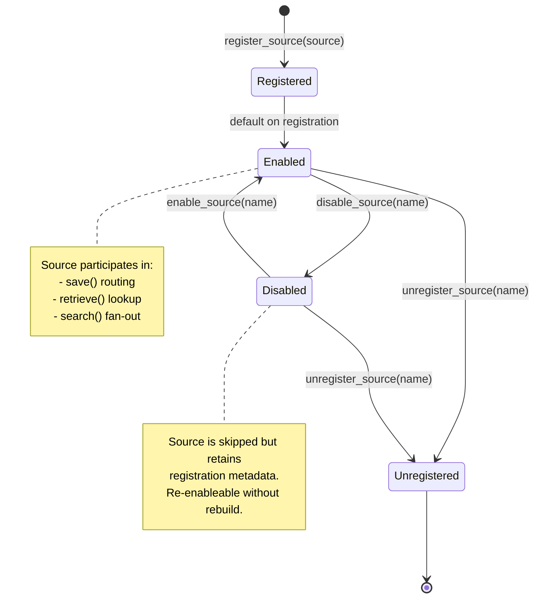
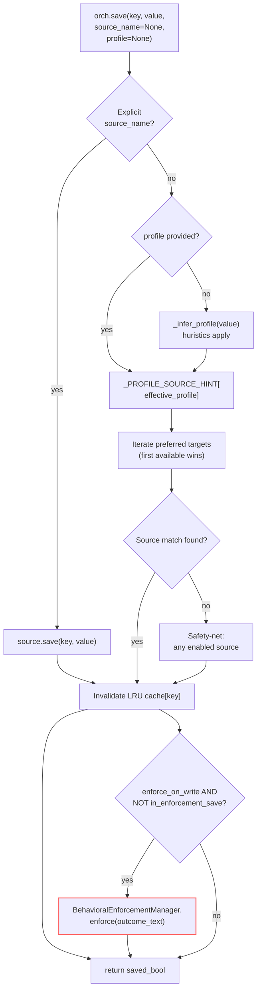
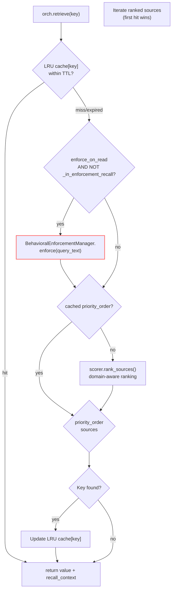
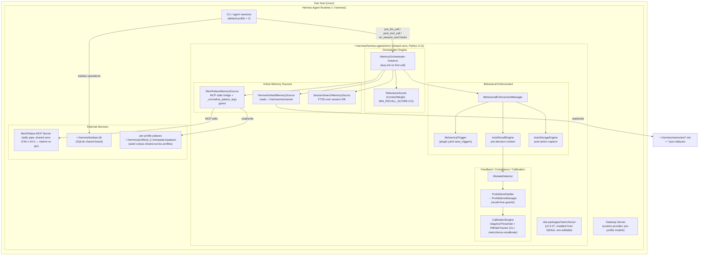

# MemChorus Architecture Documentation

**Version:** v2.0.27 (reconciled 2026-09-02, was v1.5.09) | **Date:** 2026-07-23, updated 2026-09-02 | **Author:** BuboTheWise
**Classification:** Internal — private paths included for technical accuracy

---

## Table of Contents

1. [System Overview](#system-overview)
2. [Directory Structure & Source Tree](#directory-structure--source-tree)
3. [Component Dependency Graph](#component-dependency-graph)
4. [Runtime Environment & Installation Flow](#runtime-environment--installation-flow)
5. [Memory Source Lifecycle](#memory-source-lifecycle)
6. [Orchestrator Core Engine](#orchestrator-core-engine)
7. [Save Path — Full Detail](#save-path---full-detail)
8. [Retrieve Path — Full Detail](#retrieve-path---full-detail)
9. [Search Path — Cross-Source Aggregation](#search-path---cross-source-aggregation)
10. [Behavioral Enforcement Pipeline](#behavioral-enforcement-pipeline)
11. [Feedback Loop System — Current State (post-v1.9.0)](#feedback-loop-system--current-state-post-v190)
12. [Relevance Scoring Engine](#relevance-scoring-engine)
13. [Error Handling & Graceful Degradation](#error-handling--graceful-degradation)
14. [Session Orientation Subsystem](#session-orientation-subsystem)

---

## System Overview

MemChorus is a multi-source memory orchestration layer for AI agents. It sits between the agent runtime (Hermes, OpenClaw, or custom) and one or more memory backends (Hermes default files, MemPalace MCP server, custom sources). The orchestrator provides intelligent routing on both read and write paths: deciding which source to query first and where new data should live based on profile classification.

Two key design properties:

1. **Resilience by default** — loss of any enhancement source never takes down an agent. Hermes default memory is always available locally.
2. **Cost-aware optimization** — retrieval and storage decisions consider real-time overhead so memory stays cheap to query and write.

---

## Directory Structure & Source Tree

```
src/memchorus/
├── __init__.py                          # Public API (__all__, 13 symbols) + __version__ = "2.0.27" + lazy bootstrap
├── orchestrator.py                      # MemoryOrchestrator — main routing engine (save/retrieve/search/dispatch)
├── memory_source.py                     # MemorySource ABC (save/retrieve/search/is_available)
├── hermes_memory_source.py              # HermesDefaultMemorySource — local curated files (resilient core)
├── mempalace_memory_source.py           # MemPalaceMemorySource — MCP bridge; _normalize_palace_args + _chroma_is_empty (v2.0.27 path-alignment guard)
├── mempalace_persistent_session.py      # PersistentMcpSession — persistent MCP stdio session
├── session_search_memory_source.py      # SessionSearchMemorySource — third voice over session history
├── relevance_engine.py                  # RelevanceScorer + ContextWeight + RankedResult
├── calibration_engine.py                # CalibrationEngine — empirical utility tracking (cli: memchorus-recalibrate)
├── adaptive_threshold.py                # AdaptiveThreshold — bounded auto-tuning of decision thresholds (v2.0.20)
├── hit_rate_tracker.py                  # HitRateTracker — recall hit/miss tracking sidecar
├── content_similarity.py                # RecallDeduplicator — dedup window for recall injection
├── enforcement_manager.py               # BehavioralEnforcementManager — trigger→recall→storage pipeline glue
├── behavioral_trigger.py                # BehavioralTrigger + DecisionPoint/DetectedPoint — decision-point detection
├── auto_recall_engine.py                # AutoRecallEngine — pre-decision memory surfacing (LRU cache)
├── auto_storage_engine.py               # AutoStorageEngine — post-action capture; SignificanceCategory
├── mistake_detector.py                  # MistakeDetector — correction-type detection
├── prohibition_distiller.py             # ProhibitionDistiller — distills corrections into standing prohibitions
├── prohibitions.py                      # ProhibitionsManager + Prohibition + GuardVerdict/GuardResult
├── workflow_compliance.py               # ComplianceReport — workflow compliance violations
├── tool_capture_buffer.py               # ToolCaptureBuffer — post-tool-call outcome capture buffer
├── orientation.py                       # Session-oriented recall subsystem (cache registry; TTL)
├── recursion_guard.py                   # RecursionGuard — prevents save↔capture infinite loops (max_depth=5)
├── storage_resilience.py                # StorageBatch — write-path resilience
├── locator.py                           # Content locators (heading/text extraction for recall targeting)
├── hermes_home.py                       # hermes_home()/hermes_home_str() — single source of truth for HERMES_HOME (v2.0.24)
├── hooks.py                             # MemChorusHooks — plugin hooks (pre_llm_call/post_tool_call/session)
├── auto_bootstrap.py                    # 6-step auto-bootstrap with lazy init; profile YAML config
├── auto_init.py                         # wing/room map generation + config write (cli: memchorus-init)
├── auto_lifecycle_engines.py            # AutoLifecycleState — wired lifecycle state
├── install_doctor.py                    # memchorus-doctor — install health diagnostics
├── lifecycle_manager.py                 # LifecycleManager + SweepScheduler + AuditLogger (core)
├── lifecycle_retention.py               # RetentionEngine — per-profile retention/review
├── lifecycle_eviction.py                # EvictionEngine — archive→purge sweep execution
├── lifecycle_merge.py                   # MergeEngine — merge-at-write dedup strategies (overwrite/append/union)
└── tests/                               # test_behavioral_trigger_regression.py, test_lifecycle_merge_engine.py (+ CI suite)
```

### Public API Exports (from `__init__.py` `__all__`, v2.0.27)

| Symbol | Module | Purpose |
|---|---|---|
| `MemoryOrchestrator` | orchestrator | Main facade — save/retrieve/search/dispatch |
| `MemoryProfile` | orchestrator | Write-time classification enum |
| `MemorySource` | memory_source | Abstract base class for all sources |
| `HermesDefaultMemorySource` | hermes_memory_source | Local curated file backend (resilient core) |
| `MemPalaceMemorySource` | mempalace_memory_source | MCP server bridge + path-alignment guard |
| `SessionSearchMemorySource` | session_search_memory_source | Third voice: session-history recall |
| `BehavioralTrigger` | behavioral_trigger | Detects decision points in text streams |
| `AutoRecallEngine` | auto_recall_engine | Pre-decision memory surfacing |
| `AutoStorageEngine` | auto_storage_engine | Post-action outcome capture |
| `BehavioralEnforcementManager` | enforcement_manager | Trigger → Recall → Storage pipeline glue |
| `Prohibition` / `ProhibitionsManager` | prohibitions | Standing prohibitions distilled from corrections |
| `GuardVerdict` / `GuardResult` | prohibitions | Guard evaluation result types |

> **Removed since v1.5.09:** the `feedback_loop/` package (FeedbackLoopDetector, loader, schema_v1, etc.) was accidentally committed to public history and fully purged in the v1.9.0 OpSec cycle — see `MemChorus-v1.9-Spec-Addendum.md` for the spec-level closure. Its extensibility intent survives as the `custom_loops/*.yaml` surface in the spec's functional area 5, but the Python subsystem no longer exists in the codebase.

> **CLI entry points (setup.py `console_scripts`):** `memchorus-init` (config + wing/room map scaffolding), `memchorus-doctor` (install health diagnostics), `memchorus-recalibrate` (calibration engine).

> **Hook registration:** `hooks.py` registers via `setup.cfg`/`entry_points` under the `hermes_agent.plugins` group and writes a per-home plugin YAML (`<hermes_home>/plugins/hermes-memchorus/plugin.yaml`); the **v2.0.0 planned migration to Hermes shell-hook script mode** (lower coupling, no pip reinstalls) is specced in `CHANGELOG.md` [Unreleased] and not yet implemented.

**Lazy Bootstrap:** Symbols are loaded on-demand via `__getattr__` + `_LAZY_SYMBOLS` mapping. First import triggers a full 6-step bootstrap (`auto_bootstrap._bootstrap()`) which initializes config, probes MCP, wires the three memory sources (hermes_default, mempalace, session_search), creates the orchestrator, and loads lifecycle state. A degraded fallback ensures `_instance != None` even on genuine failure (Bug 1 fix). `_instance` is exported as module-level default for direct `from memchorus import _instance` access.

---

## Component Dependency Graph

```
                    MemoryOrchestrator (core)
                         │
           ┌─────────────┼──────────────┐
           │             │              │
     save() route    retrieve()       search()
           │             │              │
           ▼             ▼              ▼
   Profile classifier  Relevance      Source fan-out
   _PROFILE_SOURCE_HINT Scorer.rank_         │
                        sources()            │
           │             │                   │
           ▼             ▼                   ▼
     ┌──────────┐  ┌────────────┐    ┌─────────────┐
     │ hermes   │  │ mempalace  │    │ all active  │
     │ default  │  │ source(s)  │    │ sources     │
     └──────────┘  └────────────┘    └─────────────┘

    MemoryOrchestrator also wires:
           │
           ▼
   BehavioralEnforcementManager
           │
      ┌────┴────┐
      │         │
      ▼         ▼
   Trigger     Recall ↔ Storage  (bidirectional for outcome capture)
```

### Feedback / Compliance / Calibration Subsystem (current, v2.0.27)

```
mistake_detector.py (detects correction signals in streams)
        │
        ▼
prohibition_distiller.py  ──▶ prohibitions.py (standing guards evaluated at recall)
        │
        ▼
feedback_loop.py (FeedbackLoopManager — live useful/stale bookkeeping)
        │
        ▼
calibration_engine.py + adaptive_threshold.py + hit_rate_tracker.py
(empirical utility feedback — drives recall cutoffs & eviction thresholds)

All surfaces ride the pre_llm_call / post_tool_call / on_session_end hook channel.
```
---

## Runtime Environment & Installation Flow

### Path Separation

| Layer | Path | Purpose |
|---|---|---|
| Dev repo (source control) | `~/Projects/MemChorus` | Git-managed source (READ-ONLY at runtime; all changes via PR→merge→reinstall cycle) |
| Runtime venv site-packages | `~/.hermes/hermes-agent/venv/lib/python3.11/site-packages/memchorus/` | Installed from GitHub (v2.0.27), non-editable; shared venv |
| Per-profile palaces | `~/.hermes/profiles/<profile>/.mempalace/palace/` | MemPalace DB per profile (chroma.sqlite3 + KG); reader pinned to this leaf by `_normalize_palace_args` |
| Hermes default memory | `~/.hermes/memories/` | MEMORY.md, USER.md + calibration JSON sidecars (always-available fallback) |
| Plugin config | `~/.hermes/plugins/hermes-memchorus/plugin.yaml` | `save_triggers` consumed by BehavioralTrigger; written by `hooks.py` |

### Installation Pipeline (v2.0.27, 2026-09-02)

```
GitHub master branch (v2.0.27, commit 604a656)
        │
        ▼  pip install 'memchorus[mcp] @ git+https://github.com/BuboTheWise/MemChorus.git@master'
~/.hermes/hermes-agent/venv/lib/python3.11/site-packages/memchorus/       ← shared Hermes venv, non-editable
        │
        ▼  import memchorus
__init__.py loads public API lazily; __version__ = "2.0.27"
        │
   ┌────┴─────────────┬────────────────────────────┐
   ▼                  ▼                            ▼
MemoryOrchestrator  MemorySource ABC        path-alignment guard
(ready to use)     (register sources)       (mempalace_memory_source,
                                             v2.0.27)
```

**Known packaging gap (OPEN, spec'd 2026-09-02):** `setup.py` does not pin `opentelemetry-*`, so a reinstall from GitHub can split OTel versions in the shared venv (observed 1.39.1/1.44.0 mix) and brick the `mempalace` CLI import. Interim re-pin in place; durable fix goes through the vault→code→reinstall cycle. See `MemChorus-Requirements.md` → "Packaging Contract: Shared-Venv Dependency Coherence".

**Rule:** Never use `pip install -e` for deployment. This isolates the runtime from dev-repo changes and ensures third-party parity testing catches packaging misconfiguration.

### Live Bootstrap Sequence

```mermaid
sequenceDiagram
    participant App as Agent Runtime
    participant Init as __init__.py
    participant Orch as MemoryOrchestrator
    participant HM as HermesDefaultSource
    participant MP as MemPalaceSource
    participant SS as SessionSearchSource

    App->>Init: import memchorus
    Init->>Init: lazy __getattr__ dispatch (not full-module load), __version__ = "2.0.27"
    App->>Orch: MemoryOrchestrator(config)
    Orch->>HM: initialize (always succeeds)
    HM-->>Orch: registered as 'hermes_default'
    Orch->>MP: initialize via MCP stdio probe
    alt MCP server reachable
        MP-->>Orch: registered as 'mempalace' (live)
    else MCP unreachable
        MP-->>Orch: degraded — source absent, recall falls back
    end
    Orch->>SS: initialize (FTS over profile session DB)
    SS-->>Orch: registered as 'session_search'
    Note over Orch,MP: v2.0.27: _normalize_palace_args runs on detected<br/>config before transport starts — reader pinned to the leaf<br/>dir holding chroma.sqlite3 (no-op when already canonical)
    Note over App,Orch: System ready — save/retrieve/search active.<br/>Declarative custom_loops YAML loader: spec'd (requirements doc),<br/>NOT in code (purged v1.9.0 OpSec cycle; grep-verified absent).
```

---

## Memory Source Lifecycle



### Registration Flow

```
call orchestrator.register_source(source_instance)
      │
      ▼
[1] Check source.name uniqueness in self.memory_sources dict
      │
      ├── Exists? → skip silently (idempotent)
      │
      ▼ New:
[2] self.memory_sources[source.name] = source
[3] self._source_enabled[source.name] = True  ← default-enabled
      │
      ▼
return True
```

---

## Orchestrator Core Engine

### Constructor Initialization

```python
MemoryOrchestrator(config=None)
    → self.config = config or {}
    → self.memory_sources = {}          # name → MemorySource mapping
    → self._scorer = RelevanceScorer(half_life_days=30.0)
    → self._enforcement_manager = None  # lazy init
    → self._retrieve_cache = {}         # LRU, TTL=default 60s, max=256 entries
    → self._source_enabled = {}         # GAP010 enable/disable state
    → self._priority_order = []         # GAP008 optional source ranking override
    → _initialize_default_sources()     # auto-registers hermes_default + mempalace
```

Key config keys:
- `enforce_on_read` (bool, default True): Enable pre-decision recall during search/retrieve
- `enforce_on_write` (bool, default True): Enable post-action storage capture during save
- `half_life_days` (float, default 30.0): Relevance decay rate
- `default_source` (str, default 'hermes_default'): Fallback target
- `cache_ttl_seconds` (float, default 60.0): LRU cache expiration window
- `priority_order` (List[str]): Override scorer ranking with explicit source order

### Internal State Diagram

```
┌───────────────────────────────────────────────┐
│              MemoryOrchestrator                │
├───────────────────────────────────────────────┤
│                                               │
│  ┌─ Sources Registry ─────────┐               │
│  │ hermes_default → Source    │               │
│  │ mempalace      → Source    │               │
│  │ custom_*       → Source    │ (optional)     │
│  └────────────────────────────┘               │
│                                               │
│  ┌─ Source Enable/Disable ────┐               │
│  │ hermes_default: True      │               │
│  │ mempalace:      True      │               │
│  └────────────────────────────┘               │
│                                               │
│  ┌─ Retrieval Cache (LRU) ────┐               │
│  │ key → (value, timestamp)  │ TTL: 60s       │
│  └────────────────────────────┘               │
│                                               │
│  ┌─ Relevance Scorer ─────────┐              │
│  │ domain_weights            │ half-life=30d   │
│  └────────────────────────────┘               │
│                                               │
│  ┌─ Behavioral Enforcement ───┐               │
│  │ _enforce_on_read: True     │ recursion guard│
│  │ _enforce_on_write: True    │ recursion guard│
│  │ manager: lazy-init         │               │
│  └────────────────────────────┘               │
│                                               │
└───────────────────┬───────────────────────────┘
                    │
           pre_llm_call hook surface
        (memory recall + feedback loops)
```

---

## Save Path — Full Detail



**Recursion Guard (GAP027):** `self._guard` (RecursionGuard with configurable max_depth, default 5) prevents infinite loops when `capture_outcome()` calls back into `save()`. Without this, a write outcome capture triggers another outcome capture recursively. Uses context manager pattern with internal RLock for thread safety.

### Profile Inference Heuristics (AUTO mode)

| Content Shape | Threshold | Classified As |
|---|---|---|
| String bytes > 4500 | `_MAX_KV_STRING_BYTES` | `LARGE_DATA_BLOCK` |
| Dict/list len > 1000 | `_JSON_LARGE_LIMIT` | `LARGE_DATA_BLOCK` |
| Dict with graph keywords in keys/values | relation, edge, entity, network, etc. | `RELATIONSHIP_GRAPH` |
| List containing 2-element tuples/edges | structural pattern | `RELATIONSHIP_GRAPH` |
| Plain dict (no graph signal) | default | `USER_PREFERENCE` |
| Everything else | fallback | `EPHEMERAL` |

### Dedup / Consolidation

```python
orch.find_duplicates(key)        → [source_names_that_have_this_key]

orch.consolidate_key(key)       → {"key": ..., "surviving": [...], "removed_sources": [...]}
    # Strategy: keep copy in best-target profile, remove redundant copies
    # Graph data → prefer mempalace; everything else → hermes_default
```

---

## Retrieve Path — Full Detail



---

## Search Path — Cross-Source Aggregation

```
orch.search(query, limit=10, domain=None)
        │
        ▼
[1] Fan out query to all enabled + available sources in parallel
        │
        ▼
[2] Collect raw results from each source:
     {source_name: [result_dicts...,]}
        │
        ▼
[3] Flatten into unified result pool
        │
        ▼
[4] RelevanceScorer.score_results(pool, domain=domain)
     ┌─────────────────────────────────────┐
     │ Per-result scoring factors:          │
     │ - Keyword overlap (TF-IDF style)    │
     │ - Semantic proximity (if available) │
     │ - Recency decay (half_life_days)    │
     │ - Domain weight multipliers         │
     └─────────────────────────────────────┘
        │
        ▼
[5] Deduplicate by content similarity
     (hash-based key matching + fuzzy overlap check)
        │
        ▼
[6] Return top-N scored results with source attribution
```

---

## Behavioral Enforcement Pipeline

The BehavioralEnforcementManager chains three engines into one unified `enforce()` call:

```mermaid
sequenceDiagram
    participant Caller as Agent / Orchestrator\n(during save or retrieve)
    participant Manager as EnforcementManager
    participant Trigger as BehavioralTrigger
    participant Recall as AutoRecallEngine
    participant Storage as AutoStorageEngine

    Caller->>Manager: enforce(input_text)
    Note over Manager: wall_clock = time.monotonic()
    Manager->>Trigger: detect_points(input_text)
    Trigger->>Trigger: scan for planning verbs,\nchoice phrases, decision markers
    Trigger-->>Manager: [DetectedPoint enum entries]

    alt triggered_points > 0
        Manager->>Recall: recall_for_context(points, orchestrator)
        Recall->>Recall: query relevant memories for each DP
        Recall-->>Manager: [recalled context dicts]
    else no points detected
        Note over Recall: skip — no decision point to prepare for
    end

    Manager->>Storage: capture_outcome(input_text, orchestrator)
    Storage->>Storage: dedup window check (30s, 0.6 similarity threshold)
    alt outcome passes dedup
        Storage->>Storage: persist summary
    else duplicate
        Note over Storage: skip — already captured recently
    end

    Manager-->>Caller: EnforcementResult(
      triggered_points=N,
      recall_context=[...],
      storage_outcome={...},
      timing_ms=X,
      errors=[]
    )
```

### EnforcementResult Dataclass Fields

| Field | Type | Description |
|---|---|---|
| `triggered_points` | int | Number of decision points detected in input text |
| `recall_context` | List[Dict] | Union of all recall hits across detected points |
| `storage_outcome` | Dict or None | Summary of last capture attempt result |
| `timing_ms` | float | Total wall-clock time for full pipeline (ms) |
| `errors` | List[str] | Per-step error messages (non-fatal, graceful degrade) |

---

## Feedback Loop System — Current State (post-v1.9.0)

> **Reconciled 2026-09-02.** The Python feedback-loop subsystem described in v1.5.09 (`feedback_loop/` package: `detector.py`, `engine.py`, `escalation.py`, `loader.py`, `schema_v1.py`) **no longer exists in the codebase** — it was accidentally committed to public history and fully purged during the v1.9.0 OpSec readiness cycle. See `MemChorus-v1.9-Spec-Addendum.md` for the spec-level closure.

**What survives in code (v2.0.27):**
- `feedback_loop.py` (single module) — `FeedbackCorrection`, `FeedbackPersistenceStore`, `FeedbackLoopManager`: live recall-feedback bookkeeping (useful/stale recording wired to `on_session_end`, closes MemChorus #138 lineage), *not* the pattern-detection subsystem.
- `mistake_detector.py` — `MistakeDetector`: correction-type detection.
- `prohibition_distiller.py` + `prohibitions.py` — distills detected mistakes into standing prohibitions/guards (`ProhibitionsManager`, `GuardVerdict`): the enforcement-side successor to the old loop concept.
- `workflow_compliance.py` — `ComplianceReport`/`Violation`: format-compliance monitoring.
- `calibration_engine.py` + `adaptive_threshold.py` + `hit_rate_tracker.py` — empirical utility tracking driving recall/eviction cutoffs (v2.0.20 auto-tuning loop).

**What survives in spec (not yet re-implemented):** the declarative `~/.hermes/custom_loops/*.yaml` extensibility surface (spec functional area 5) — validation/loader machinery was removed with the package; re-implementation, if chosen, would land per the vault-first rule (spec → issue → PR).


## Relevance Scoring Engine

### Score Calculation

```
score(result) = keyword_weight * keyword_overlap    # G1: term frequency match
              + semantic_weight * semantic_proximity  # if embeddings available
              + recency_weight * decay_factor          # exponential by age
              + source_weight * source_type_bias        # per-source base trust score
              * domain_multiplier                       # per-domain ContextWeight

where:
  decay_factor = 1 / (2 ^ (age_in_days / half_life_days))
  default half_life_days = 30.0
```

### ContextWeights Configuration

```python
ContextWeight(
    keyword=0.4,       # term overlap importance
    semantic=0.3,      # vector proximity (if available)
    recency=0.2,       # age weighting
    source_type=0.1    # per-backend trust baseline
)

# Per-domain overrides possible:
ContextWeight("code_analysis"):   keyword=0.5, recency=0.3
ContextWeight("memory_review"):   semantic=0.4, recency=0.2
```

---

## Error Handling & Graceful Degradation

### Source Failure Modes

| Scenario | Behavior | Impact |
|---|---|---|
| MemPalace MCP server down | Source marked unavailable; recall falls back to hermes_default + session_search (single warning log) | Semantic search over the palace unavailable; KV/default recall continues |
| Hermes default files missing/permission error | Raises warning, marks source unavailable | Orchestrator skips to next source |
| All sources unavailable | Returns None/empty list | Agent gets no memory — degrades but does not crash |
| YAML loop definition malformed | Logs warning, disables that rule | Other loops remain active; gateway stable |
| Relevance scorer fails on input | Falls back to priority_order or default ranking | Degraded scoring, not broken lookup |

### Recursion Prevention

The recursion prevention mechanism evolved from boolean flags to a depth counter (GAP027):
- `RecursionGuard` (depth counter) — used by orchestrator.py's `save()` post-write enforcement hook. Thread-safe via internal RLock, configurable max_depth defaults to 5. Read paths (`retrieve`, `retrieve_with_source`, `search`) had enforcement removed by GAP044 so no guard is active on those paths.
- `_REC_GUARD` (module-level bool) + `_in_enforcement_recall` (instance flag) — retained in `auto_recall_engine.py` to prevent re-entry during `on_decision_point()` calls. Both are reset in `finally` blocks.

---

## Future Work: Lifecycle Management

Planned but not yet implemented (design documented):

```python
# Config shape (not yet live)
config = {
    "lifecycle": {
        "enabled": True,  # opt-in — off by default
        "retention_days": {"user_preference": 365, "ephemeral": 7},
        "eviction": {"importance_min": 0.3, "batch_size": 50},
        "archive": {"grace_days": 14, "storage": "~/.hermes/memory_archive/"}
    }
}
```

Three-phase deletion: soft mark → archive grace period → hard remove at expiry.

---

## Local Deployment Map (<user> — reconciled to v2.0.27, 2026-09-02)

This section shows exactly where MemChorus lives in the running environment — real paths, actual process topology, memory locations. Verified against the live tree on 2026-09-02 (user `<user>`, home `~`, `~/.hermes`).

### Directory Layout (v2.0.27, commit 604a656)

```
~/
├── Projects/
│   └── MemChorus/                                ← git dev repo (master, v2.0.27 @ 604a656)
│       └── src/memchorus/                        (READ-ONLY at runtime — install is from GitHub)
│
├── Documents/Obsidian/<vault>/
│   └── Projects/MemChorus/                       ← Vault: point-of-truth docs (this folder)
│       ├── MemChorus-Architecture.md             (this document)
│       ├── MemChorus-Spec.md
│       ├── MemChorus-Requirements.md
│       ├── MemPalace-Optimization-Spec.md
│       └── CHANGELOG.md
│
└── .hermes/
    ├── hermes-agent/venv/lib/python3.11/site-packages/
    │   └── memchorus/                            ← INSTALLED PACKAGE (v2.0.27, non-editable, shared venv)
    │       ├── __init__.py                       (__version__ = "2.0.27")
    │       ├── orchestrator.py  memory_source.py  hermes_memory_source.py
    │       ├── mempalace_memory_source.py        (+ _normalize_palace_args / _chroma_is_empty)
    │       ├── session_search_memory_source.py  relevance_engine.py
    │       ├── behavioral_trigger.py  auto_recall_engine.py  auto_storage_engine.py
    │       ├── enforcement_manager.py  prohibitions.py  prohibition_distiller.py
    │       ├── feedback_loop.py                    (MODULE, not a package — v1.9.0+; correction bookkeeping)
    │       ├── mistake_detector.py  calibration_engine.py  adaptive_threshold.py
    │       ├── hit_rate_tracker.py  content_similarity.py  tool_capture_buffer.py
    │       ├── storage_resilience.py  workflow_compliance.py  locator.py  orientation.py
    │       ├── hermes_home.py  install_doctor.py  auto_init.py  auto_bootstrap.py
    │       ├── lifecycle_* (manager/eviction/retention/merge)  recursion_guard.py  hooks.py
    │       └── (37 .py modules total — no feedback_loop/ subpackage since v1.9.0)
    │
    ├── memories/                                 ← Hermes default memory backend (always-available fallback)
    │   ├── MEMORY.md / USER.md
    │   ├── _hit_rate_index.json                  (CalibrationEngine/HitRateTracker sidecar)
    │   └── action-ctx-key-<ts>.json              (per-decision outcome captures)
    │
    ├── plugins/                                  ← per-home plugin registration
    │   └── hermes-memchorus/plugin.yaml          (save_triggers; written by hooks.py at bootstrap)
    │
    ├── profiles/
    │   ├── <profile-b>/      .mempalace/palace/
    │   ├── <profile-a>/  .mempalace/palace/
    │   ├── <profile-c>/      .mempalace/palace/
    │   └── default/   (no palace — vacuous, correct)
    │
    ├── kanban.db  kanban/  projects.db  state.db ← shared board / project state
    └── config.yaml
```

> **Path note (corrected 2026-09-02):** the previous draft of this map showed `~/.hermes/memory/`, `~/workspace/Code/MemChorus`, `~/workspace/<vault>/`, and a live `custom_loops/` loader. The live tree is `~/.hermes/memories/`, `~/Projects/MemChorus`, `~/Documents/Obsidian/<vault>/`, and **no `custom_loops/` dir** — the declarative YAML loader was purged in the v1.9.0 OpSec cycle and has not been re-implemented (`grep custom_loops src/` returns nothing). `feedback_loop/` is now a **single module** (`feedback_loop.py`), not the `detector/engine/escalation/loader/schema_v1` package.

### Local Process Topology (v2.0.27)



### Installation vs Runtime Separation (v2.0.27)

```
DEVELOPMENT PATH (NOT used at runtime, READ-ONLY):
~/Projects/MemChorus/src/memchorus/
    └── git commits land here. NEVER imported directly by Hermes.
        Rule: all fixes via repo PR → merge → reinstall → retest.

RUNTIME PATH (what actually executes):
~/.hermes/hermes-agent/venv/lib/python3.11/site-packages/memchorus/
    └── Fresh install per release from GitHub via:
        pip install "memchorus[mcp] @ git+https://github.com/BuboTheWise/MemChorus.git@master"

Data flow for updates:
GitHub push → dev-repo commit/PR/merge → release tag → reinstall package → live test
  remote HEAD = 604a656 (v2.0.27, master, no stray branches)
  __version__ = "2.0.27"  (verified in installed __init__.py)
```

### Memory File Locations by Source

| Source | Read Path | Write Path | Format |
|---|---|---|---|
| `HermesDefaultMemorySource` | `~/.hermes/memories/MEMORY.md` | `~/.hermes/memories/MEMORY.md` | Markdown |
| `HermesDefaultMemorySource` | `~/.hermes/memories/USER.md` | `~/.hermes/memories/USER.md` | Markdown |
| `MemPalaceMemorySource` | MCP stdio → chroma/FTS/KG under `~/.hermes/profiles/<profile>/.mempalace/palace/` | MCP stdio → drawers in same palace | Structured drawers per wing/room (chroma.sqlite3 + knowledge_graph.sqlite3) |
| `SessionSearchMemorySource` | FTS5 over the profile session DB | session writes via Hermes | message rows |
| Calibration sidecars | `~/.hermes/memories/_hit_rate_index.json`, `action-ctx-key-*.json` | same | JSON |
| Plugin config | `~/.hermes/plugins/hermes-memchorus/plugin.yaml` (save_triggers) | written by `hooks.py` at bootstrap | YAML |

### Hook Injection Points

MemChorus hooks into Hermes through the `hermes_agent.plugins` entry-point (`memchorus = memchorus.hooks` in setup.py), writing `~/.hermes/plugins/hermes-memchorus/plugin.yaml` at bootstrap:

```
Channel 1: Memory recall / enrichment (pre_llm_call)
┌─────────────────────────────────────┐
│ Hermes Gateway                      │
│                                     │
│  pre_llm_call hook fires:           │
│   → orchestrator.search (search(),  │
│     not retrieve() — retrieve is    │
│     exact-key only)                 │
│   → mistake_detector / prohibitions │
│     guard evaluation                │
│   → orientation context (kanban     │
│     task / workspace / cwd)         │
│   → results injected into system-   │
│     prompt context (char-budgeted,  │
│     MIN_RECALL_SCORE floor 0.5)     │
│                                     │
│  LLM receives enriched context      │
└─────────────────────────────────────┘

Channel 2: Behavioral enforcement (during action execution)
┌─────────────────────────────────────┐
│ Hermes Agent Loop                   │
│                                     │
│  On tool call (post_tool_call):     │
│   → save() with deterministic md5   │
│     hash keys                       │
│   → storage_resilience batching     │
│   → recursion guard prevents loop   │
│                                     │
│  On session end (on_session_end):   │
│   → HitRateTracker record_useful /  │
│     record_stale                    │
│   → feedback_loop exhaust-TTL       │
│     bookkeeping (corrections)       │
└─────────────────────────────────────┘

Note: the v2.0.0 spec's migration to Hermes shell-hook script mode
(lower coupling, no pip reinstalls) is still pending — see
Spec-v2.0-file-hook-migration.md.
```

---

## Session Orientation Subsystem

The **orientation module** (`src/memchorus/orientation.py`) provides automatic project context injection at session start. When a new Kanban task begins, the subsystem queries both the knowledge graph and semantic search for relevant memories about the current project, delivering up to 5 items of contextual material without requiring any manual input from the agent.

### Entry Point

```
Hermes on_session_start hook
        │
        ▼  calls orientation_search(env_task=HERMES_KANBAN_TASK)
   _build_orientation_query() — constructs query specs
        │
        ▼ check LRU cache first (TTL=60s, max 256 entries)
   Cache hit? → return immediately (no MCP round-trip)
        │
        ▼ miss / expired
   Execute queries against MemoryOrchestrator.search()
        │
        ▼ de-duplicate by key, cap to limit (default 5)
   Inject results into session brief context
```

### Project Resolution Priority Chain

The subsystem determines *which project* to query for using a three-level priority chain:

| Priority | Source | Example | Fallback |
|---|---|---|---|
| 1 | `HERMES_KANBAN_TASK` env var | `<task-id>` | skip to next |
| 2 | `HERMES_WORKSPACE` env var (basename) | `/tmp/workspace/dir` → `dir` | skip to next |
| 3 | Current working directory (basename) | `MemChorus/` → `MemChorus` | silent empty return |

### Query Construction

For a resolved project named `"MemChorus"`, two queries are built:

```python
[
    {"type": "kg",        "query": "MemChorus relationship entity"},
    {"type": "semantic",  "query": "session context MemChorus current task"},
]
```

Both query types delegate to `orchestrator.search()` — the KG query uses keyword/entity matching while the semantic query leverages vector proximity. Results are merged with deduplication by `key` field, capped at the configured limit (default 5).

### Cache Design

| Component | Type | Details |
|---|---|---|
| `_CacheKey` | Frozen dataclass | `(project: str, query_types: Tuple[str,...])` — hashable, immutable |
| `_CacheEntry` | Dataclass | `(results: List[Dict], timestamp: float, ttl: int)` |
| `_CacheRegistry` | Class | LRU eviction at max capacity (256 default). Oldest-by-timestamp entry evicted. |
| `clear_orientation_cache()` | Function | Global cache purge for testing / manual management |

Cache TTL defaults to 60 seconds, meaning repeated orientation calls within the same minute return instantly without hitting MCP or disk.

### Graceful Degradation

Per spec acceptance criteria:
- **AC-O1:** Results capped to `limit` items (default 5)
- **AC-O2:** Cache hits served without MCP round-trip
- **AC-O3:** Silent empty result when no project detected — no warning log
- Only logs warnings on genuine errors (MCP unreachable, orchestrator exception)

### Recursion Safety

Orientation queries run through `orchestrator.search()`. Note that read path enforcement was removed by GAP044, so `search()` no longer carries a recursion guard. The `_REC_GUARD` / `_in_enforcement_recall` guard in `auto_recall_engine.py` prevents re-entry if the AutoRecallEngine is invoked during an existing decision-point handling cycle inside `enforce()` → `on_decision_point()` chains. Thread safety of the depth counter in orchestrator.save() comes from RecursionGuard's internal RLock.

---

*Document maintained by BuboTheWise. Source of truth is `src/memchorus/` HEAD on master branch.*